# Mini-SFU: Flow of Implementation

Companion to [`plan.md`](./plan.md). All diagrams are Mermaid and render on GitHub, GitLab, VS Code (Markdown Preview Mermaid) and most documentation tools.

**Legend:** `A`, `B`, `C` are browser clients. `SIG` is the signaling gateway. `ROOM` is the Room and Peer logic. `ENG` is the media engine (Producers, Consumers, RtpRewriter). `PUB-T` and `SUB-T` are the publisher and subscriber transports of a peer.

---

## 1. Topology: why N:N works through an SFU

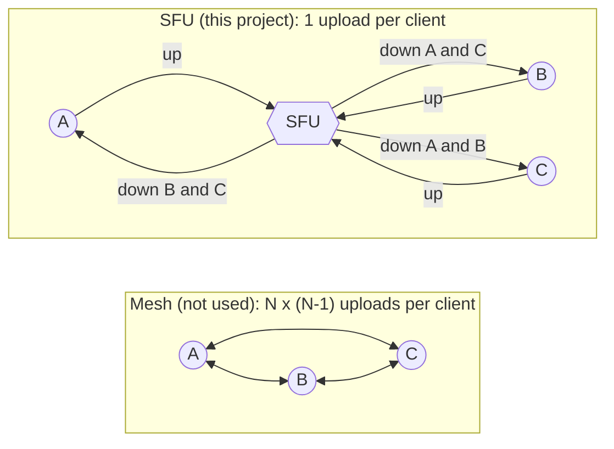

Each client uploads one copy of its media. The server decrypts it, rewrites the headers per receiver, and sends N-1 re-encrypted copies out.

---

## 2. Build order (implementation flow)

The order in which the system is built, with the dependency of each step. Maps to the phases in `plan.md` §10.

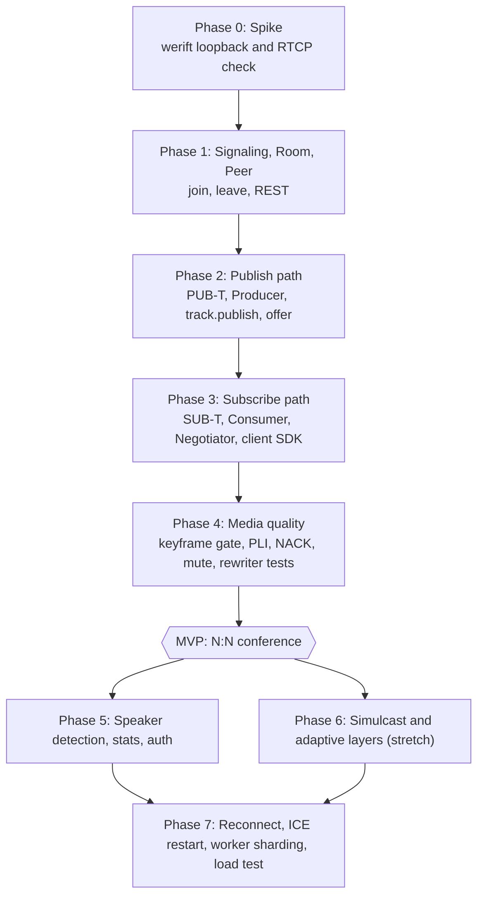

---

## 3. Connection and join

Two sockets of different kinds are involved: one WebSocket for signaling, then two PeerConnections for media. The PeerConnections are created **after** the join succeeds.

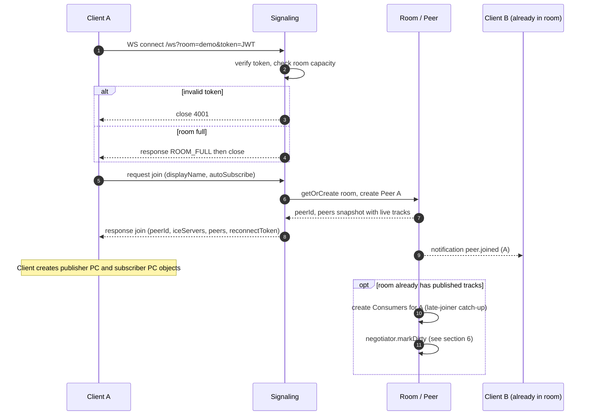

---

## 4. Publish a track (A turns on camera)

Key idea: A **declares** the track first (`track.publish`), then sends the SDP offer with a `mid → cid` map. The server never has to guess which media section is which.

```mermaid
sequenceDiagram
  autonumber
  participant A as Client A
  participant SIG as Signaling
  participant ROOM as Room / Peer A
  participant PUBT as PUB-T (A)
  participant ENG as Engine
  participant B as Client B

  A->>A: getUserMedia then pc.addTrack(camera)
  A->>SIG: request track.publish (cid, kind=video, source=camera)
  SIG->>ROOM: register pending track (cid)
  ROOM-->>A: response trackSid = TR_a1b2
  A->>A: createOffer then setLocalDescription
  A->>SIG: request publisher.offer (sdp, mids = mid0 to cid)
  SIG->>PUBT: setRemoteDescription(offer)
  PUBT->>PUBT: createAnswer
  PUBT-->>A: response sdp answer
  A->>A: setRemoteDescription(answer)

  par ICE and DTLS
    A-->>SIG: ice.candidate (publisher)
    SIG->>PUBT: addIceCandidate
    PUBT-->>A: ice.candidate (publisher) notification
  end
  Note over A,PUBT: ICE connected then DTLS handshake then SRTP keys derived

  PUBT-->>ENG: onTrack(IncomingTrack mid0)
  ENG->>ROOM: bind mid0 to cid to trackSid, create Producer TR_a1b2
  ROOM-->>B: notification track.published (TR_a1b2)
  ROOM->>ROOM: for each other peer: create Consumer, mark subscriber dirty
  Note over ROOM: continues in section 5 and 6
```

---

## 5. Subscribe and renegotiate (server-driven)

The subscriber PC is always **offered by the server**. The client only answers. This eliminates glare.

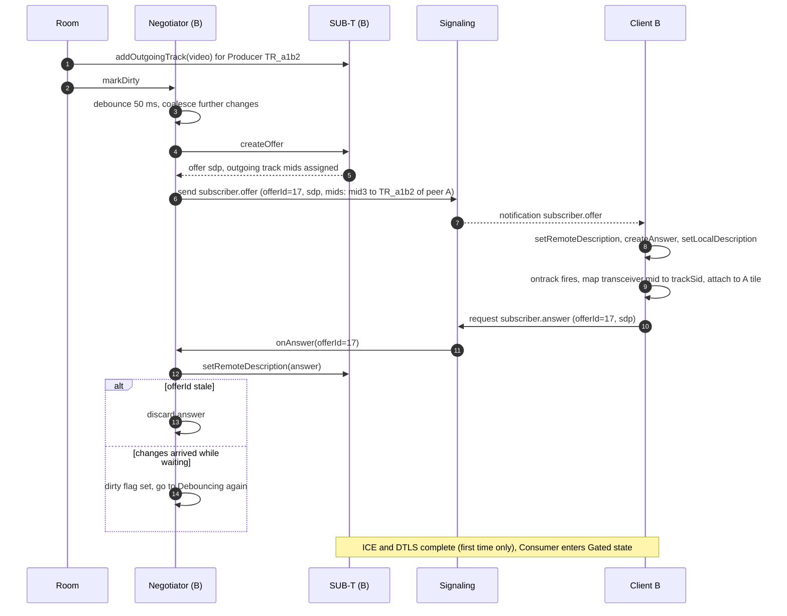

---

## 6. The data plane: how one RTP packet travels (core SFU function)

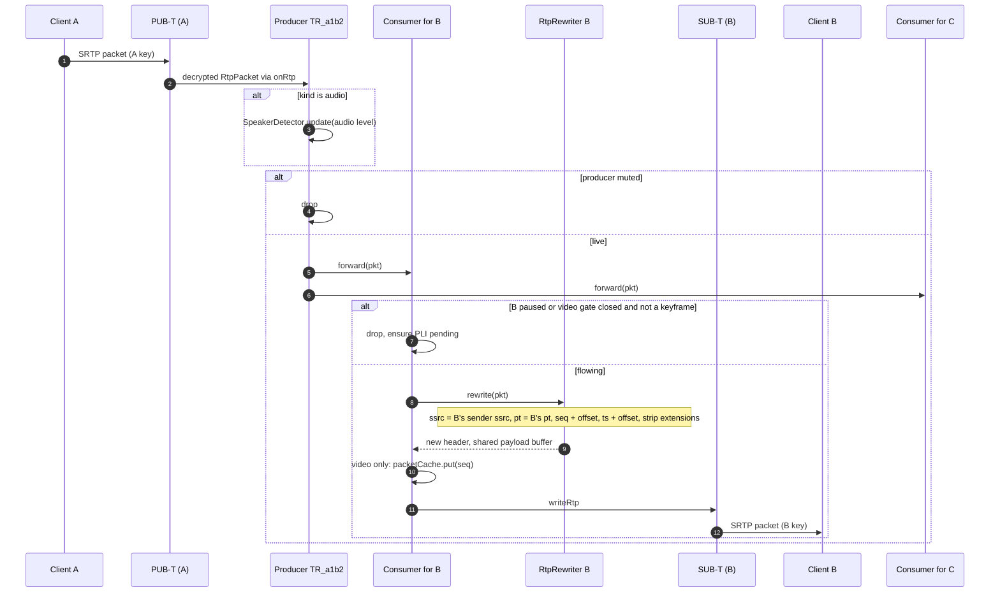

Per-packet rules: synchronous, no `await`, no per-packet logging, header cloned (never mutate the shared packet), payload buffer shared (zero-copy).

---

## 7. Keyframe handling (late joiner, resume, loss)

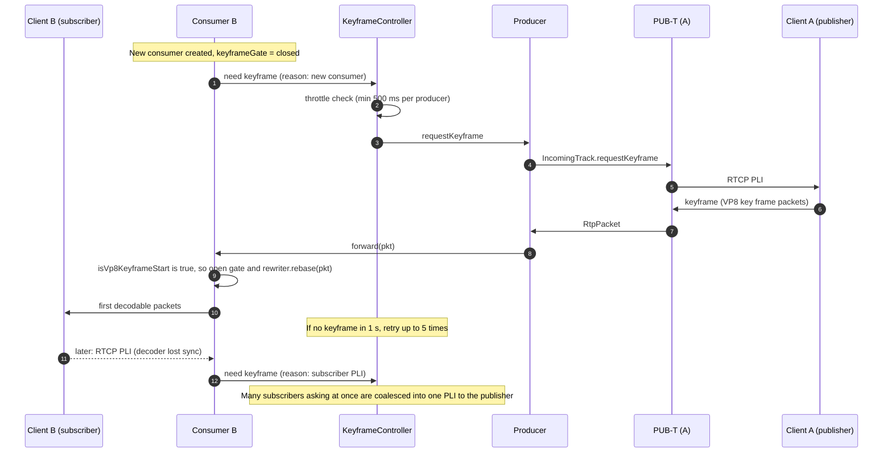

---

## 8. Loss recovery (NACK served by the SFU)

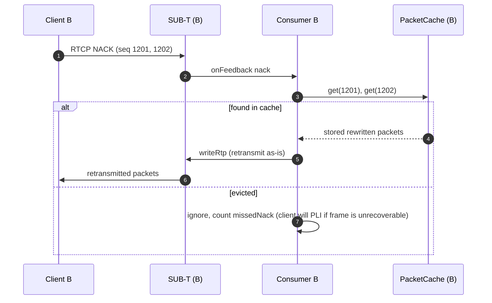

Because the cache stores **already rewritten** packets, the retransmit needs no reverse mapping to the publisher's sequence numbers.

---

## 9. Mute, pause, resume

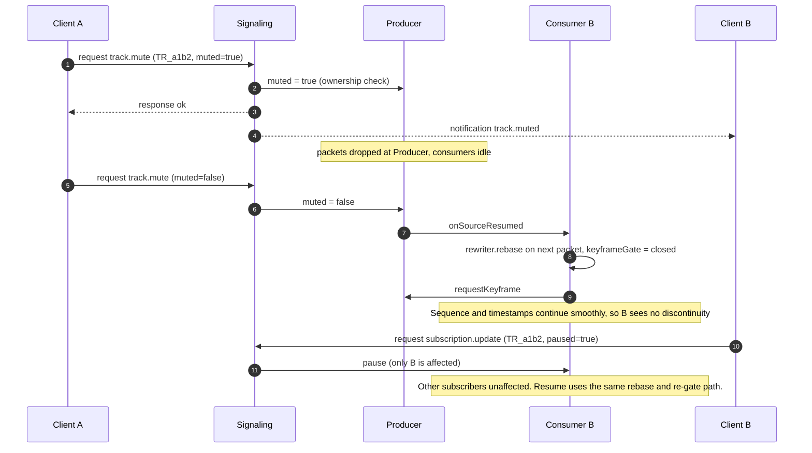

---

## 10. Unpublish and leave

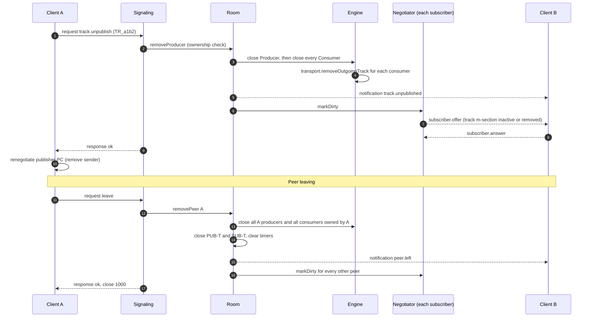

---

## 11. Peer lifecycle, disconnect and reconnect

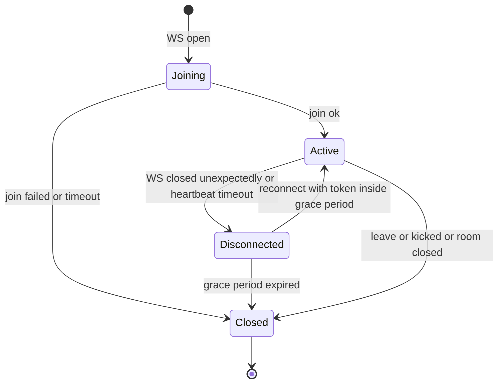

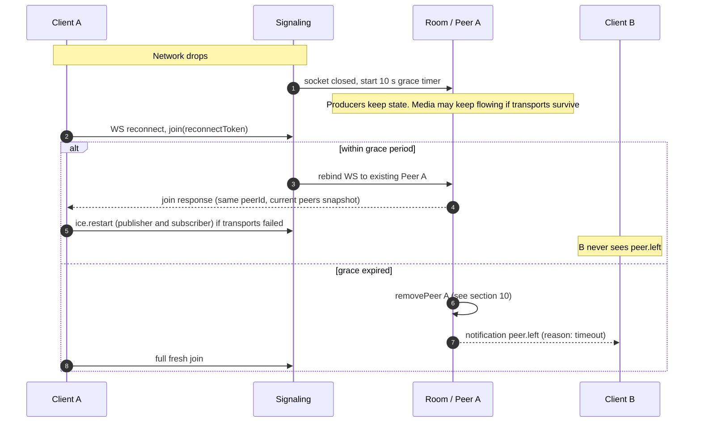

---

## 12. Active speaker detection

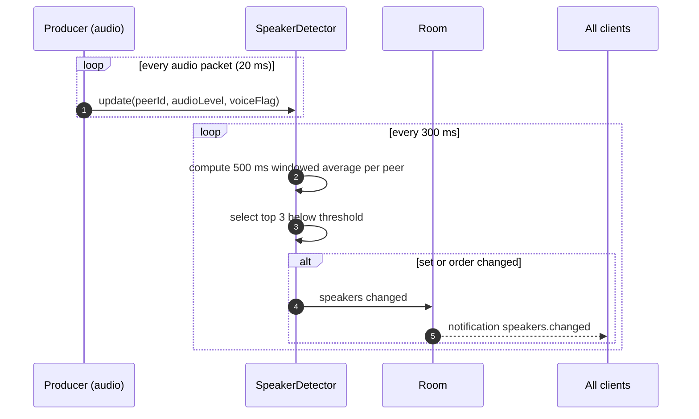

---

## 13. Simulcast layer switch (phase 6)

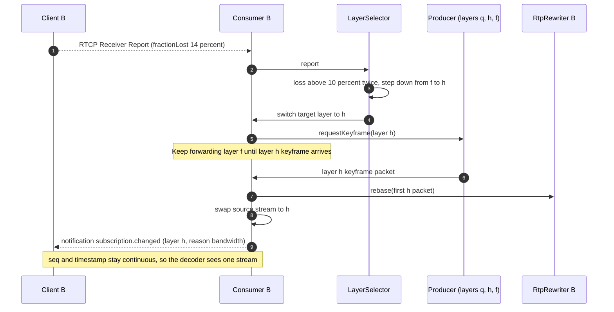

---

## 14. Negotiation concurrency (what the per-peer queue and negotiator guarantee)

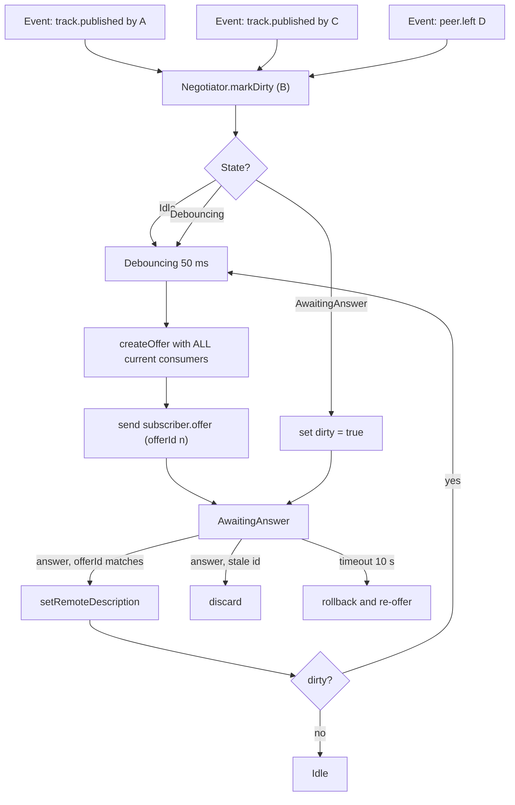

Three events arriving close together result in **one** offer (or two if one arrives mid-negotiation), never three overlapping ones.

---

## 15. End-to-end summary (one screen)

```mermaid
flowchart LR
  A1["1. WS + join"] --> A2["2. track.publish (cid)"] --> A3["3. publisher.offer + mids"] --> A4["4. ICE + DTLS up"]
  A4 --> A5["5. onTrack then Producer"] --> A6["6. Consumers for every peer"] --> A7["7. subscriber.offer + mids"]
  A7 --> A8["8. subscriber.answer"] --> A9["9. Gate closed, PLI sent"] --> A10["10. Keyframe opens gate"]
  A10 --> A11["11. RTP forwarded with rewrite"] --> A12["12. NACK, PLI, mute, speaker, stats while live"]
  A12 --> A13["13. Unpublish or leave, renegotiate, cleanup"]
```
