# OpenRTC: Flow of Implementation

Companion to [`plan.md`](./plan.md) and the Major Project presentation *"OpenRTC: A Benchmarked, Extensible SFU for WebRTC"* (SLRTCE, Dept. of Information Technology, AY 2026-27). All diagrams are Mermaid and render on GitHub, GitLab, VS Code (Markdown Preview Mermaid) and most documentation tools.

> **Naming:** the product name is **OpenRTC**. The npm package and some older docs still say `mini-sfu`, and slides 5, 10 and 14 of the presentation still say "RelaySync". Use one name everywhere before the final submission.

**Legend:** `A`, `B`, `C` are browser clients. `SIG` is the signaling gateway. `ROOM` is the Room and Peer logic. `ENG` is the media engine (Producers, Consumers, RtpRewriter). `PUB-T` and `SUB-T` are the publisher and subscriber transports of a peer.

**Status tags used in this document:** ✅ implemented and tested, 🟡 partially implemented, 🔲 designed, not yet implemented.

---

## 0. Where the project stands

### 0.1 Presentation objectives (slide 5) vs. the codebase

| # | Objective | Status | Evidence / what is left |
|---|---|---|---|
| 01 | Custom SFU from WebRTC primitives | ✅ | `werift` behind `IMediaTransport` (`WeriftTransport.ts`), dual-PeerConnection design |
| 02 | WebSocket signaling (SDP + ICE) | ✅ | `SignalingServer.ts`, `protocol.ts`, explicit `mid → cid` maps |
| 03 | Room / Transport / Producer / Consumer model | ✅ | `Room.ts`, `Peer.ts`, `Producer.ts`, `Consumer.ts` |
| 04 | RTP forwarding, simulcast layer selection, TWCC | 🟡 | RTP rewriting, keyframe gating, NACK, PLI done. Loss-based `LayerSelector` only pauses and resumes video. **Missing:** `rid` demux, real layer switching, TWCC parsing (section 13) |
| 05 | Rewind-Live (rolling media buffer) | 🔲 | Section 17 |
| 06 | Universal Captions (server ASR + translation) | 🔲 | Section 18 |
| 07 | Flowspace (dynamic regrouping via subscription management) | ✅ | Server, client SDK, demo UI, 11 tests (section 16) |
| 08 | Reproducible benchmarking vs mediasoup, Janus, LiveKit | 🟡 | Prometheus `/metrics` and `/api/stats` exist. **Missing:** load generators, impairment scripts, comparison harness (section 19) |

### 0.2 Proposed architecture (slide 10) and its implementation status

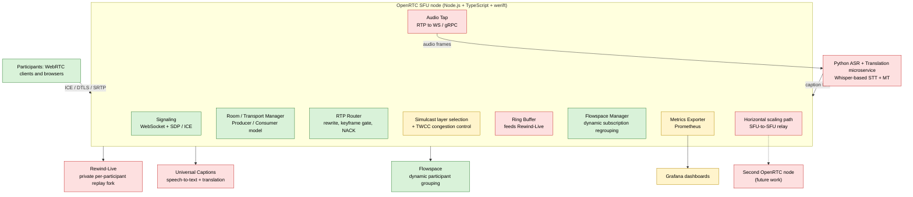
```mermaid
flowchart TB
  P["Participants: WebRTC clients and browsers"] -->|"ICE / DTLS / SRTP"| NODE

  subgraph NODE["OpenRTC SFU node (Node.js + TypeScript + werift)"]
    direction TB
    SIGN["Signaling<br/>WebSocket + SDP / ICE"]
    RTM["Room / Transport Manager<br/>Producer / Consumer model"]
    ROUTER["RTP Router<br/>rewrite, keyframe gate, NACK"]
    LAYER["Simulcast layer selection<br/>+ TWCC congestion control"]
    RING["Ring Buffer<br/>feeds Rewind-Live"]
    FLOW["Flowspace Manager<br/>dynamic subscription regrouping"]
    MET["Metrics Exporter<br/>Prometheus"]
    TAP["Audio Tap<br/>RTP to WS / gRPC"]
    SCALE["Horizontal scaling path<br/>SFU-to-SFU relay"]
  end

  NODE --> RW["Rewind-Live<br/>private per-participant replay fork"]
  NODE --> CC["Universal Captions<br/>speech-to-text + translation"]
  NODE --> FS["Flowspace<br/>dynamic participant grouping"]
  TAP -->|"audio frames"| ASR["Python ASR + Translation microservice<br/>Whisper-based STT + MT"]
  ASR -->|"caption text"| NODE
  MET --> GRAF["Grafana dashboards"]
  SCALE -.-> NODE2["Second OpenRTC node<br/>(future work)"]

  classDef done fill:#d9f2d9,stroke:#2e7d32,color:#000;
  classDef part fill:#fff4cc,stroke:#b58900,color:#000;
  classDef todo fill:#fde0e0,stroke:#c62828,color:#000;
  class SIGN,RTM,ROUTER,FLOW,FS,P done;
  class LAYER,MET,GRAF part;
  class RING,TAP,ASR,RW,CC,SCALE,NODE2 todo;
```

Green = implemented, yellow = partial, red = designed only.

### 0.3 Slide 10 component → source file

| Architecture box | File(s) | Status |
|---|---|---|
| Signaling | `src/signaling/SignalingServer.ts`, `protocol.ts`, `rateLimit.ts` | ✅ |
| Room / Transport Manager | `src/sfu/Room.ts`, `RoomManager.ts`, `Peer.ts`, `SubscriberNegotiator.ts`, `src/transport/*` | ✅ |
| RTP Router | `Producer.ts`, `Consumer.ts`, `RtpRewriter.ts`, `PacketCache.ts`, `KeyframeController.ts`, `codecs/vp8.ts` | ✅ |
| Congestion control | `LayerSelector.ts` (loss-based only) | 🟡 |
| Flowspace Manager | `Room.switchZone`, `FlowspacePolicy` in `SubscriptionPolicy.ts`, `Consumer.setZoneBlocked` | ✅ |
| Metrics Exporter | `src/util/metrics.ts`, `/metrics` in `src/api/http.ts` | ✅ (needs Grafana dashboard JSON) |
| Speaker detection | `SpeakerDetector.ts` | ✅ |
| Ring Buffer (Rewind-Live) | `RollingMediaBuffer.ts` (new) | 🔲 |
| Audio Tap + ASR service | `AudioTap.ts` (new), `asr/server.py` (new) | 🔲 |
| Horizontal scaling | n/a | 🔲 stretch goal |

---

## 1. Topology: why N:N works through an SFU

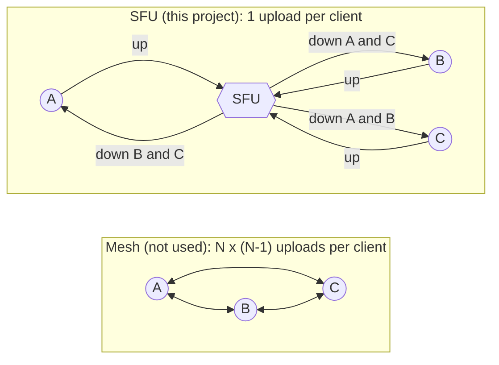
```mermaid
flowchart LR
  subgraph Mesh["Mesh (not used): N x (N-1) uploads per client"]
    direction LR
    m1((A)) <--> m2((B))
    m1 <--> m3((C))
    m2 <--> m3
  end

  subgraph SFU["SFU (this project): 1 upload per client"]
    direction LR
    a((A)) -- "up" --> S{{SFU}}
    b((B)) -- "up" --> S
    c((C)) -- "up" --> S
    S -- "down B and C" --> a
    S -- "down A and C" --> b
    S -- "down A and B" --> c
  end
```

Each client uploads one copy of its media. The server decrypts it, rewrites the headers per receiver, and sends N-1 re-encrypted copies out.

---

## 2. Build order (implementation flow)

The order in which the system is built, with the dependency of each step. Phases 0–7 are the SFU core from `plan.md` §10. Phases F1–F5 are the work that the presentation promises on top of it.

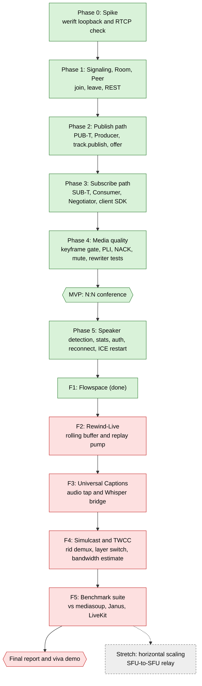
```mermaid
flowchart TD
  P0["Phase 0: Spike<br/>werift loopback and RTCP check"] --> P1
  P1["Phase 1: Signaling, Room, Peer<br/>join, leave, REST"] --> P2
  P2["Phase 2: Publish path<br/>PUB-T, Producer, track.publish, offer"] --> P3
  P3["Phase 3: Subscribe path<br/>SUB-T, Consumer, Negotiator, client SDK"] --> P4
  P4["Phase 4: Media quality<br/>keyframe gate, PLI, NACK, mute, rewriter tests"] --> MVP{{"MVP: N:N conference"}}
  MVP --> P5["Phase 5: Speaker detection, stats, auth, reconnect, ICE restart"]
  P5 --> F1["F1: Flowspace (done)"]
  F1 --> F2["F2: Rewind-Live<br/>rolling buffer and replay pump"]
  F2 --> F3["F3: Universal Captions<br/>audio tap and Whisper bridge"]
  F3 --> F4["F4: Simulcast and TWCC<br/>rid demux, layer switch, bandwidth estimate"]
  F4 --> F5["F5: Benchmark suite<br/>vs mediasoup, Janus, LiveKit"]
  F5 --> DONE{{"Final report and viva demo"}}
  F5 -.-> STRETCH["Stretch: horizontal scaling<br/>SFU-to-SFU relay"]

  classDef done fill:#d9f2d9,stroke:#2e7d32,color:#000;
  classDef todo fill:#fde0e0,stroke:#c62828,color:#000;
  classDef stretch fill:#eeeeee,stroke:#757575,color:#000,stroke-dasharray: 4 3;
  class P0,P1,P2,P3,P4,MVP,P5,F1 done;
  class F2,F3,F4,F5,DONE todo;
  class STRETCH stretch;
```

Why this order: F1 is pure forwarding logic with no new moving parts. F2 and F3 both tap the RTP stream at the Producer, so F2's buffer design informs F3's tap. F4 is the highest-risk item (depends on what `werift` negotiates), so it comes after the features are stable. F5 must come last because it measures everything above.

---
## 3. Connection and join

Two sockets of different kinds are involved: one WebSocket for signaling, then two PeerConnections for media. The PeerConnections are created **after** the join succeeds.

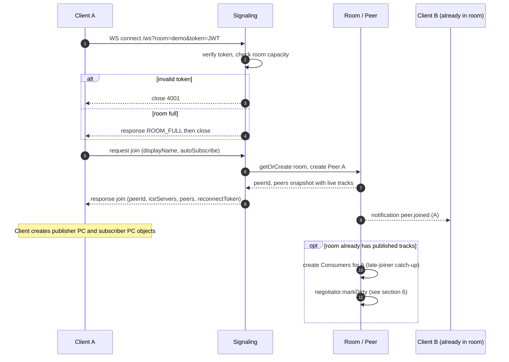
```mermaid
sequenceDiagram
  autonumber
  participant A as Client A
  participant SIG as Signaling
  participant ROOM as Room / Peer
  participant B as Client B (already in room)

  A->>SIG: WS connect /ws?room=demo&token=JWT
  SIG->>SIG: verify token, check room capacity
  alt invalid token
    SIG-->>A: close 4001
  else room full
    SIG-->>A: response ROOM_FULL then close
  end
  A->>SIG: request join (displayName, autoSubscribe)
  SIG->>ROOM: getOrCreate room, create Peer A
  ROOM-->>SIG: peerId, peers snapshot with live tracks
  SIG-->>A: response join (peerId, iceServers, peers, reconnectToken)
  ROOM-->>B: notification peer.joined (A)
  Note over A: Client creates publisher PC and subscriber PC objects
  opt room already has published tracks
    ROOM->>ROOM: create Consumers for A (late-joiner catch-up)
    ROOM->>ROOM: negotiator.markDirty (see section 6)
  end
```

---

## 4. Publish a track (A turns on camera)

Key idea: A **declares** the track first (`track.publish`), then sends the SDP offer with a `mid → cid` map. The server never has to guess which media section is which.

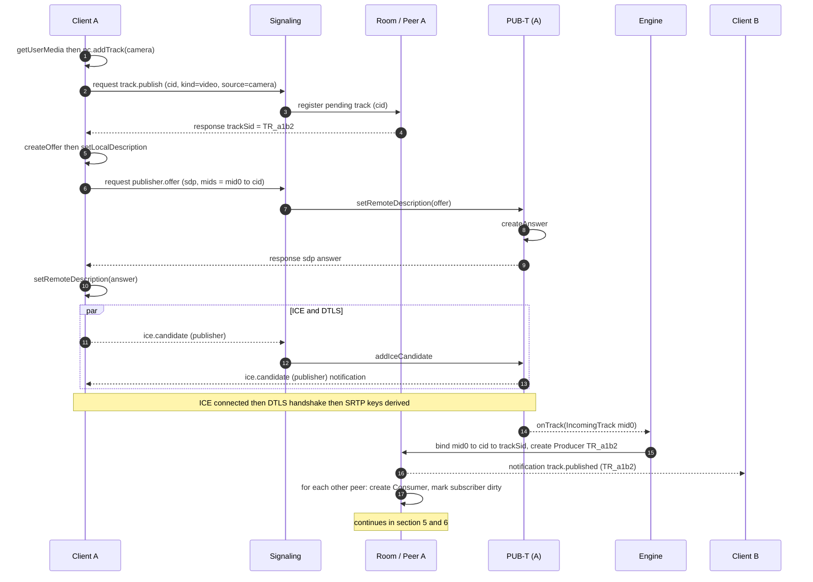
```mermaid
sequenceDiagram
  autonumber
  participant A as Client A
  participant SIG as Signaling
  participant ROOM as Room / Peer A
  participant PUBT as PUB-T (A)
  participant ENG as Engine
  participant B as Client B

  A->>A: getUserMedia then pc.addTrack(camera)
  A->>SIG: request track.publish (cid, kind=video, source=camera)
  SIG->>ROOM: register pending track (cid)
  ROOM-->>A: response trackSid = TR_a1b2
  A->>A: createOffer then setLocalDescription
  A->>SIG: request publisher.offer (sdp, mids = mid0 to cid)
  SIG->>PUBT: setRemoteDescription(offer)
  PUBT->>PUBT: createAnswer
  PUBT-->>A: response sdp answer
  A->>A: setRemoteDescription(answer)

  par ICE and DTLS
    A-->>SIG: ice.candidate (publisher)
    SIG->>PUBT: addIceCandidate
    PUBT-->>A: ice.candidate (publisher) notification
  end
  Note over A,PUBT: ICE connected then DTLS handshake then SRTP keys derived

  PUBT-->>ENG: onTrack(IncomingTrack mid0)
  ENG->>ROOM: bind mid0 to cid to trackSid, create Producer TR_a1b2
  ROOM-->>B: notification track.published (TR_a1b2)
  ROOM->>ROOM: for each other peer: create Consumer, mark subscriber dirty
  Note over ROOM: continues in section 5 and 6
```

---

## 5. Subscribe and renegotiate (server-driven)

The subscriber PC is always **offered by the server**. The client only answers. This eliminates glare.

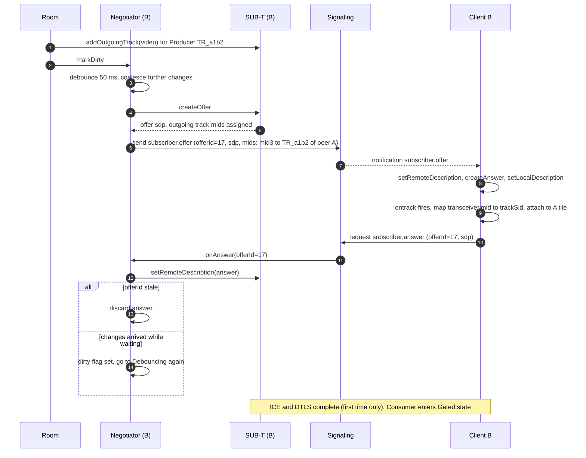
```mermaid
sequenceDiagram
  autonumber
  participant ROOM as Room
  participant NEG as Negotiator (B)
  participant SUBT as SUB-T (B)
  participant SIG as Signaling
  participant B as Client B

  ROOM->>SUBT: addOutgoingTrack(video) for Producer TR_a1b2
  ROOM->>NEG: markDirty
  NEG->>NEG: debounce 50 ms, coalesce further changes
  NEG->>SUBT: createOffer
  SUBT-->>NEG: offer sdp, outgoing track mids assigned
  NEG->>SIG: send subscriber.offer (offerId=17, sdp, mids: mid3 to TR_a1b2 of peer A)
  SIG-->>B: notification subscriber.offer
  B->>B: setRemoteDescription, createAnswer, setLocalDescription
  B->>B: ontrack fires, map transceiver.mid to trackSid, attach to A tile
  B->>SIG: request subscriber.answer (offerId=17, sdp)
  SIG->>NEG: onAnswer(offerId=17)
  NEG->>SUBT: setRemoteDescription(answer)
  alt offerId stale
    NEG->>NEG: discard answer
  else changes arrived while waiting
    NEG->>NEG: dirty flag set, go to Debouncing again
  end
  Note over SUBT,B: ICE and DTLS complete (first time only), Consumer enters Gated state
```

---

## 6. The data plane: how one RTP packet travels (core SFU function)

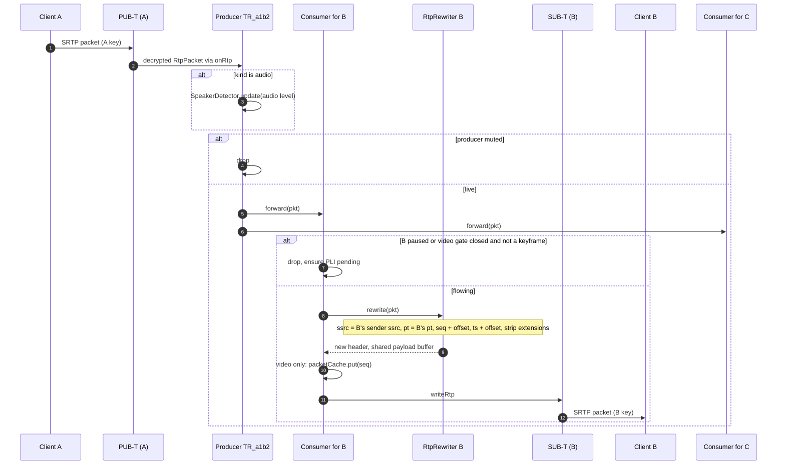
```mermaid
sequenceDiagram
  autonumber
  participant A as Client A
  participant PUBT as PUB-T (A)
  participant PROD as Producer TR_a1b2
  participant CB as Consumer for B
  participant RWB as RtpRewriter B
  participant SUBTB as SUB-T (B)
  participant B as Client B
  participant CC as Consumer for C

  A->>PUBT: SRTP packet (A key)
  PUBT->>PROD: decrypted RtpPacket via onRtp
  alt kind is audio
    PROD->>PROD: SpeakerDetector.update(audio level)
  end
  alt producer muted
    PROD->>PROD: drop
  else live
    PROD->>CB: forward(pkt)
    PROD->>CC: forward(pkt)
    alt B paused or video gate closed and not a keyframe
      CB->>CB: drop, ensure PLI pending
    else flowing
      CB->>RWB: rewrite(pkt)
      Note over RWB: ssrc = B's sender ssrc, pt = B's pt, seq + offset, ts + offset, strip extensions
      RWB-->>CB: new header, shared payload buffer
      CB->>CB: video only: packetCache.put(seq)
      CB->>SUBTB: writeRtp
      SUBTB->>B: SRTP packet (B key)
    end
  end
```

Per-packet rules: synchronous, no `await`, no per-packet logging, header cloned (never mutate the shared packet), payload buffer shared (zero-copy).

---

## 7. Keyframe handling (late joiner, resume, loss)

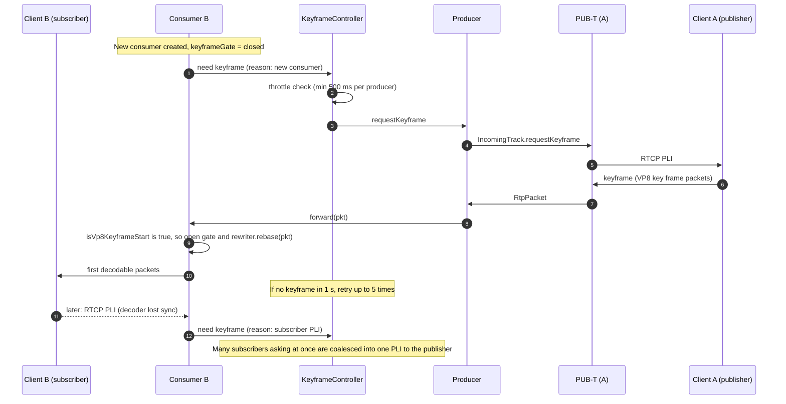
```mermaid
sequenceDiagram
  autonumber
  participant B as Client B (subscriber)
  participant CB as Consumer B
  participant KC as KeyframeController
  participant PROD as Producer
  participant PUBT as PUB-T (A)
  participant A as Client A (publisher)

  Note over CB: New consumer created, keyframeGate = closed
  CB->>KC: need keyframe (reason: new consumer)
  KC->>KC: throttle check (min 500 ms per producer)
  KC->>PROD: requestKeyframe
  PROD->>PUBT: IncomingTrack.requestKeyframe
  PUBT->>A: RTCP PLI
  A->>PUBT: keyframe (VP8 key frame packets)
  PUBT->>PROD: RtpPacket
  PROD->>CB: forward(pkt)
  CB->>CB: isVp8KeyframeStart is true, so open gate and rewriter.rebase(pkt)
  CB->>B: first decodable packets
  Note over KC: If no keyframe in 1 s, retry up to 5 times
  B-->>CB: later: RTCP PLI (decoder lost sync)
  CB->>KC: need keyframe (reason: subscriber PLI)
  Note over KC: Many subscribers asking at once are coalesced into one PLI to the publisher
```

---

## 8. Loss recovery (NACK served by the SFU)

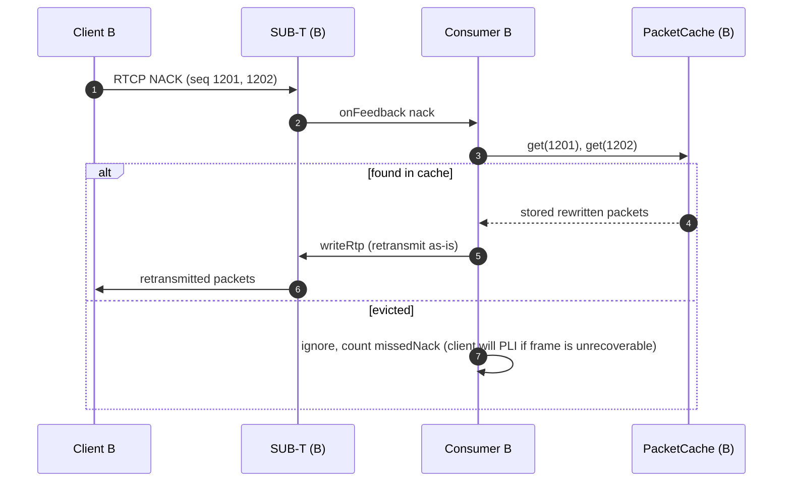
```mermaid
sequenceDiagram
  autonumber
  participant B as Client B
  participant SUBTB as SUB-T (B)
  participant CB as Consumer B
  participant PC as PacketCache (B)

  B->>SUBTB: RTCP NACK (seq 1201, 1202)
  SUBTB->>CB: onFeedback nack
  CB->>PC: get(1201), get(1202)
  alt found in cache
    PC-->>CB: stored rewritten packets
    CB->>SUBTB: writeRtp (retransmit as-is)
    SUBTB->>B: retransmitted packets
  else evicted
    CB->>CB: ignore, count missedNack (client will PLI if frame is unrecoverable)
  end
```

Because the cache stores **already rewritten** packets, the retransmit needs no reverse mapping to the publisher's sequence numbers.

---

## 9. Mute, pause, resume

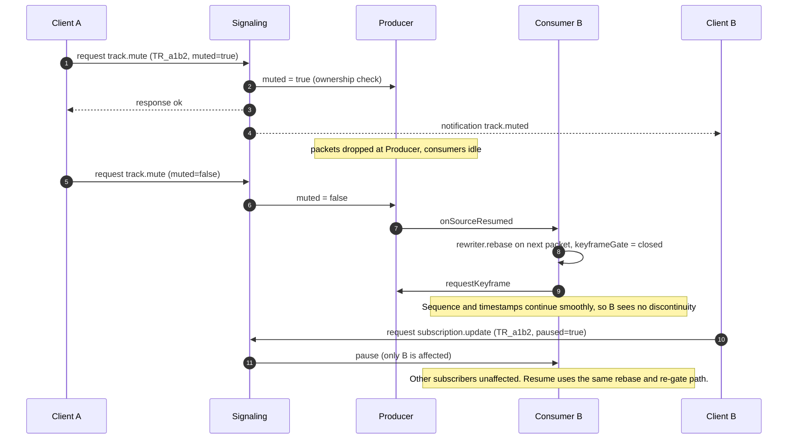
```mermaid
sequenceDiagram
  autonumber
  participant A as Client A
  participant SIG as Signaling
  participant PROD as Producer
  participant CB as Consumer B
  participant B as Client B

  A->>SIG: request track.mute (TR_a1b2, muted=true)
  SIG->>PROD: muted = true (ownership check)
  SIG-->>A: response ok
  SIG-->>B: notification track.muted
  Note over PROD: packets dropped at Producer, consumers idle
  A->>SIG: request track.mute (muted=false)
  SIG->>PROD: muted = false
  PROD->>CB: onSourceResumed
  CB->>CB: rewriter.rebase on next packet, keyframeGate = closed
  CB->>PROD: requestKeyframe
  Note over CB: Sequence and timestamps continue smoothly, so B sees no discontinuity

  B->>SIG: request subscription.update (TR_a1b2, paused=true)
  SIG->>CB: pause (only B is affected)
  Note over CB: Other subscribers unaffected. Resume uses the same rebase and re-gate path.
```

---

## 10. Unpublish and leave

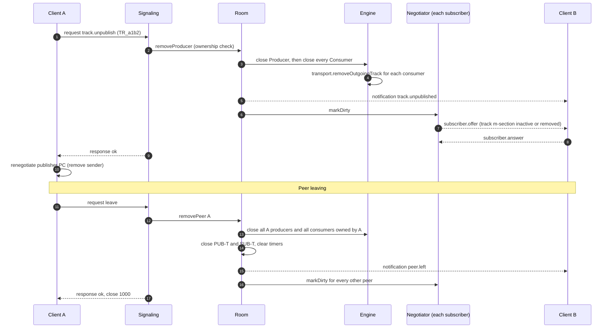
```mermaid
sequenceDiagram
  autonumber
  participant A as Client A
  participant SIG as Signaling
  participant ROOM as Room
  participant ENG as Engine
  participant NEG as Negotiator (each subscriber)
  participant B as Client B

  A->>SIG: request track.unpublish (TR_a1b2)
  SIG->>ROOM: removeProducer (ownership check)
  ROOM->>ENG: close Producer, then close every Consumer
  ENG->>ENG: transport.removeOutgoingTrack for each consumer
  ROOM-->>B: notification track.unpublished
  ROOM->>NEG: markDirty
  NEG-->>B: subscriber.offer (track m-section inactive or removed)
  B-->>NEG: subscriber.answer
  SIG-->>A: response ok
  A->>A: renegotiate publisher PC (remove sender)

  Note over A,B: Peer leaving
  A->>SIG: request leave
  SIG->>ROOM: removePeer A
  ROOM->>ENG: close all A producers and all consumers owned by A
  ROOM->>ROOM: close PUB-T and SUB-T, clear timers
  ROOM-->>B: notification peer.left
  ROOM->>NEG: markDirty for every other peer
  SIG-->>A: response ok, close 1000
```

---

## 11. Peer lifecycle, disconnect and reconnect

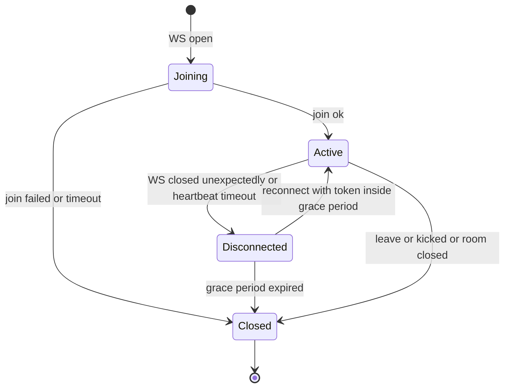
```mermaid
stateDiagram-v2
  [*] --> Joining: WS open
  Joining --> Active: join ok
  Joining --> Closed: join failed or timeout
  Active --> Disconnected: WS closed unexpectedly or heartbeat timeout
  Disconnected --> Active: reconnect with token inside grace period
  Disconnected --> Closed: grace period expired
  Active --> Closed: leave or kicked or room closed
  Closed --> [*]
```

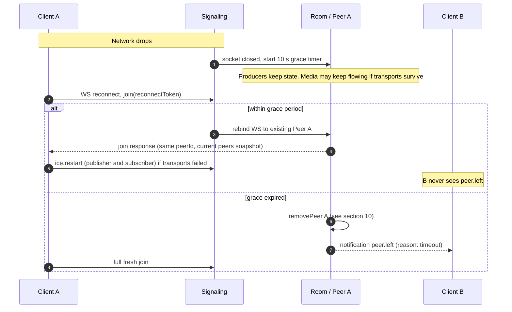
```mermaid
sequenceDiagram
  autonumber
  participant A as Client A
  participant SIG as Signaling
  participant ROOM as Room / Peer A
  participant B as Client B

  Note over A,SIG: Network drops
  SIG->>ROOM: socket closed, start 10 s grace timer
  Note over ROOM: Producers keep state. Media may keep flowing if transports survive
  A->>SIG: WS reconnect, join(reconnectToken)
  alt within grace period
    SIG->>ROOM: rebind WS to existing Peer A
    ROOM-->>A: join response (same peerId, current peers snapshot)
    A->>SIG: ice.restart (publisher and subscriber) if transports failed
    Note over B: B never sees peer.left
  else grace expired
    ROOM->>ROOM: removePeer A (see section 10)
    ROOM-->>B: notification peer.left (reason: timeout)
    A->>SIG: full fresh join
  end
```

---

## 12. Active speaker detection

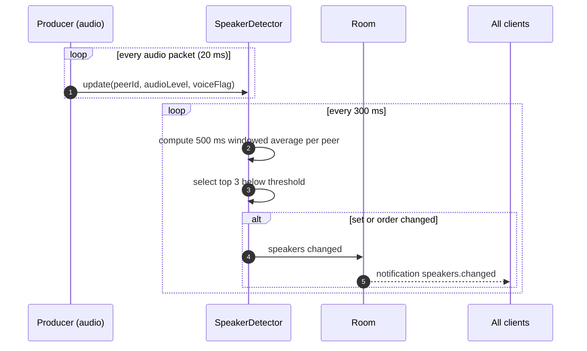
```mermaid
sequenceDiagram
  autonumber
  participant PROD as Producer (audio)
  participant SD as SpeakerDetector
  participant ROOM as Room
  participant ALL as All clients

  loop every audio packet (20 ms)
    PROD->>SD: update(peerId, audioLevel, voiceFlag)
  end
  loop every 300 ms
    SD->>SD: compute 500 ms windowed average per peer
    SD->>SD: select top 3 below threshold
    alt set or order changed
      SD->>ROOM: speakers changed
      ROOM-->>ALL: notification speakers.changed
    end
  end
```

---

## 13. Simulcast layer switch and TWCC (F4, 🟡 partially implemented)

**Today:** `LayerSelector` reads RTCP Receiver Reports and *pauses or resumes* the single video stream (`subscription.changed`, reason `bandwidth`). There is no real multi-layer forwarding and no TWCC yet.

**Target (slides 3, 6, 9):** the publisher sends three encodings (`rid` = `q`, `h`, `f`). The SFU forwards exactly one layer per subscriber and switches layers on keyframe boundaries, driven first by loss and later by TWCC.

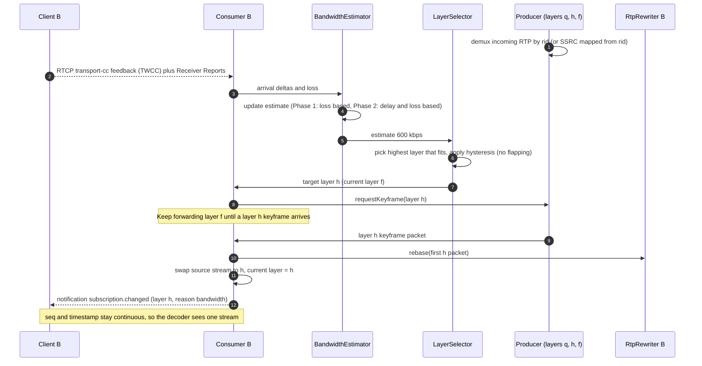
```mermaid
sequenceDiagram
  autonumber
  participant B as Client B
  participant CB as Consumer B
  participant BWE as BandwidthEstimator
  participant LS as LayerSelector
  participant PROD as Producer (layers q, h, f)
  participant RWB as RtpRewriter B

  PROD->>PROD: demux incoming RTP by rid (or SSRC mapped from rid)
  B-->>CB: RTCP transport-cc feedback (TWCC) plus Receiver Reports
  CB->>BWE: arrival deltas and loss
  BWE->>BWE: update estimate (Phase 1: loss based, Phase 2: delay and loss based)
  BWE->>LS: estimate 600 kbps
  LS->>LS: pick highest layer that fits, apply hysteresis (no flapping)
  LS->>CB: target layer h (current layer f)
  CB->>PROD: requestKeyframe(layer h)
  Note over CB: Keep forwarding layer f until a layer h keyframe arrives
  PROD->>CB: layer h keyframe packet
  CB->>RWB: rebase(first h packet)
  CB->>CB: swap source stream to h, current layer = h
  CB-->>B: notification subscription.changed (layer h, reason bandwidth)
  Note over CB,B: seq and timestamp stay continuous, so the decoder sees one stream
```

**Delivery plan**
- **Phase 1 (must have):** `rid` demux in `Producer.ts`, `currentLayer` / `targetLayer` in `Consumer.ts`, switch on keyframe only, step down above about 5% loss and step up after about 10 s clean.
- **Phase 2 (nice to have):** parse TWCC feedback and run a delay-based estimator. If time is short, report this as future work. Loss-based adaptation is an honest, defensible scope.
- **Risk to check first:** that `werift` negotiates the `rid` header extension and `a=simulcast`. Write a small spike test before building anything else.

---
## 14. Negotiation concurrency (what the per-peer queue and negotiator guarantee)

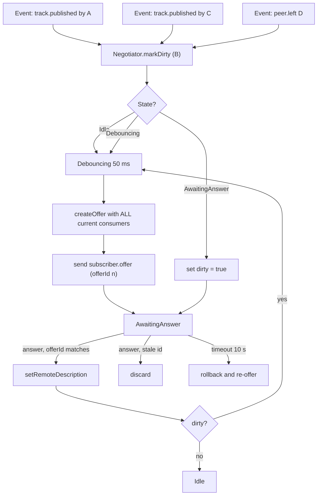
```mermaid
flowchart TD
  E1["Event: track.published by A"] --> Q
  E2["Event: track.published by C"] --> Q
  E3["Event: peer.left D"] --> Q
  Q["Negotiator.markDirty (B)"] --> D{"State?"}
  D -- Idle --> DB["Debouncing 50 ms"]
  D -- Debouncing --> DB
  D -- AwaitingAnswer --> DF["set dirty = true"]
  DB --> OFF["createOffer with ALL current consumers"]
  OFF --> SEND["send subscriber.offer (offerId n)"]
  SEND --> WAIT["AwaitingAnswer"]
  WAIT -- "answer, offerId matches" --> APPLY["setRemoteDescription"]
  WAIT -- "answer, stale id" --> DROP["discard"]
  WAIT -- "timeout 10 s" --> RETRY["rollback and re-offer"]
  APPLY --> CHK{"dirty?"}
  CHK -- yes --> DB
  CHK -- no --> IDLE["Idle"]
  DF --> WAIT
```

Three events arriving close together result in **one** offer (or two if one arrives mid-negotiation), never three overlapping ones.

---

## 15. Core end-to-end summary (original SFU path)

```mermaid
flowchart LR
  A1["1. WS + join"] --> A2["2. track.publish (cid)"] --> A3["3. publisher.offer + mids"] --> A4["4. ICE + DTLS up"]
  A4 --> A5["5. onTrack then Producer"] --> A6["6. Consumers for every peer"] --> A7["7. subscriber.offer + mids"]
  A7 --> A8["8. subscriber.answer"] --> A9["9. Gate closed, PLI sent"] --> A10["10. Keyframe opens gate"]
  A10 --> A11["11. RTP forwarded with rewrite"] --> A12["12. NACK, PLI, mute, speaker, stats while live"]
  A12 --> A13["13. Unpublish or leave, renegotiate, cleanup"]
```
---

# Part II: OpenRTC flagship features

## 16. Flowspace: breakout rooms without rejoining (F1, ✅ implemented)

**Idea (slides 3, 6, 8):** a breakout is not a second `Room`. Every peer has a `zoneId` (default `main`) inside the same room. Consumers exist for every publisher/subscriber pair, so the subscriber SDP never changes. Each consumer has a `zoneBlocked` flag, and moving zones only flips these flags in memory. No ICE, DTLS or SDP work happens.

### 16.1 Switching zones

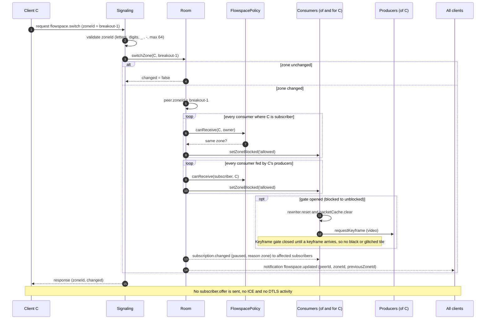
```mermaid
sequenceDiagram
  autonumber
  participant C as Client C
  participant SIG as Signaling
  participant ROOM as Room
  participant POL as FlowspacePolicy
  participant CON as Consumers (of and for C)
  participant PROD as Producers (of C)
  participant ALL as All clients

  C->>SIG: request flowspace.switch (zoneId = breakout-1)
  SIG->>SIG: validate zoneId (letters, digits, _ . -, max 64)
  SIG->>ROOM: switchZone(C, breakout-1)
  alt zone unchanged
    ROOM-->>SIG: changed = false
  else zone changed
    ROOM->>ROOM: peer.zoneId = breakout-1
    loop every consumer where C is subscriber
      ROOM->>POL: canReceive(C, owner)
      POL-->>ROOM: same zone?
      ROOM->>CON: setZoneBlocked(!allowed)
    end
    loop every consumer fed by C's producers
      ROOM->>POL: canReceive(subscriber, C)
      ROOM->>CON: setZoneBlocked(!allowed)
    end
    opt gate opened (blocked to unblocked)
      CON->>CON: rewriter.reset and packetCache.clear
      CON->>PROD: requestKeyframe (video)
      Note over CON: Keyframe gate closed until a keyframe arrives, so no black or glitched tile
    end
    ROOM-->>CON: subscription.changed (paused, reason zone) to affected subscribers
    ROOM-->>ALL: notification flowspace.updated (peerId, zoneId, previousZoneId)
  end
  SIG-->>C: response (zoneId, changed)
  Note over C,ALL: No subscriber.offer is sent, no ICE and no DTLS activity
```

### 16.2 The forwarding decision for one packet

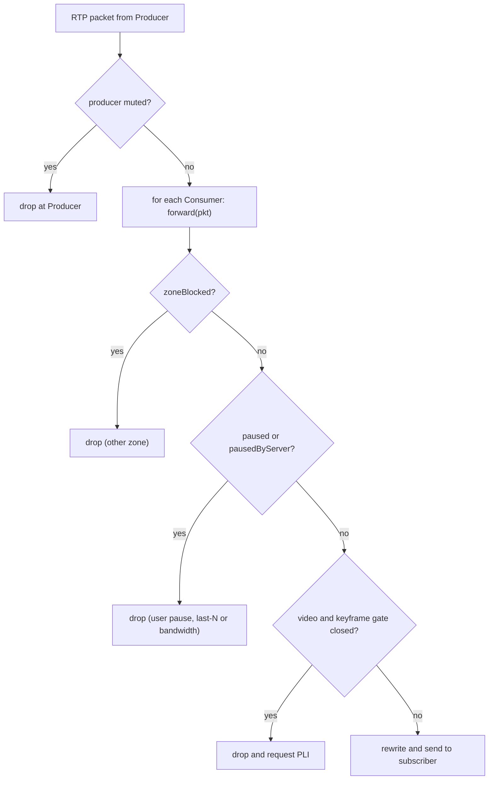
```mermaid
flowchart TD
  PK["RTP packet from Producer"] --> M{"producer muted?"}
  M -- yes --> X1["drop at Producer"]
  M -- no --> F["for each Consumer: forward(pkt)"]
  F --> Z{"zoneBlocked?"}
  Z -- yes --> X2["drop (other zone)"]
  Z -- no --> P{"paused or pausedByServer?"}
  P -- yes --> X3["drop (user pause, last-N or bandwidth)"]
  P -- no --> K{"video and keyframe gate closed?"}
  K -- yes --> X4["drop and request PLI"]
  K -- no --> R["rewrite and send to subscriber"]
```

`zoneBlocked` is deliberately **independent** of the pause flags. A last-N or bandwidth decision can never accidentally un-gate a consumer from another zone, and returning to `main` does not undo a pause the user chose themselves (this is the "prior state restored" behaviour from slide 8).

### 16.3 Rules and invariants

| Rule | Where |
|---|---|
| Consumers are created for everyone, gated by policy | `Room.createConsumer` passes `zoneBlocked: !canReceive(...)` |
| A late joiner gets correctly gated consumers | `Room.catchUpPeer` goes through `createConsumer` |
| Last-N speaker video ranks speakers **within the subscriber's zone only** | `Room.applyLastN` |
| Gate changes never create or destroy transceivers | unit test "never renegotiates" |
| Policy is pluggable (e.g. allow low-volume `main` audio into breakouts) | `SubscriptionPolicy.canReceive?` |

### 16.4 Messages

| Direction | Message | Payload |
|---|---|---|
| client to server | request `flowspace.switch` | `{ zoneId }` |
| server to client | response | `{ zoneId, changed }` |
| server to all | notification `flowspace.updated` | `{ peerId, zoneId, previousZoneId }` |
| server to subscriber | notification `subscription.changed` | `{ trackSid, paused, reason: "zone" }` |
| server to client | join response / `PeerInfo` | adds `zoneId` |

**Client SDK:** `client.switchZone(zoneId)`, `client.zoneId`, `client.isInMyZone(peerId)`, event `zoneChanged`. **Demo:** zone input, *Switch zone* button, and tiles of other zones are hidden.

**Known limit:** any peer may switch to any zone. A real deployment needs a host-only permission check in `Room.switchZone`.

---

## 17. Rewind-Live: private instant replay (F2, 🔲 designed)

**Idea (slides 3, 6, 8):** the server keeps the last N seconds of each stream in a rolling buffer. A subscriber can replay a recent moment on a **private fork** while the live call continues untouched, with no client-side recording.

### 17.1 Always-on capture path

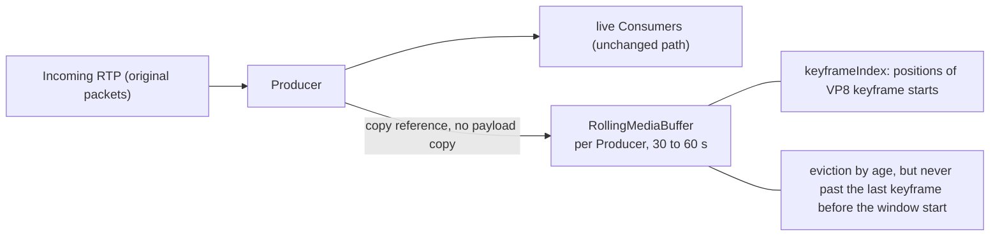
```mermaid
flowchart LR
  IN["Incoming RTP (original packets)"] --> PROD["Producer"]
  PROD --> LIVE["live Consumers (unchanged path)"]
  PROD -->|"copy reference, no payload copy"| RB["RollingMediaBuffer<br/>per Producer, 30 to 60 s"]
  RB --- KI["keyframeIndex: positions of VP8 keyframe starts"]
  RB --- EV["eviction by age, but never past the last keyframe before the window start"]
```

Store the **original** packets (not rewritten ones) together with `arrivalTimeMs` and `isKeyframeStart`. Rewriting happens at playback, with its own rewriter. Memory check: 30 s of 1 Mbps video is about 4 MB per stream.

### 17.2 Replay session

```mermaid
sequenceDiagram
  autonumber
  participant B as Client B
  participant SIG as Signaling
  participant ROOM as Room
  participant RB as RollingMediaBuffer
  participant RC as ReplayConsumer (private to B)
  participant SUBT as SUB-T (B)

  B->>SIG: request replay.start (trackSid, secondsAgo = 15)
  SIG->>ROOM: startReplay(B, trackSid, 15)
  ROOM->>RB: findStart(now - 15 s)
  RB-->>ROOM: nearest earlier keyframe index
  ROOM->>ROOM: take a spare replay slot (pre-negotiated m-line)
  ROOM->>RC: create with its own RtpRewriter (new SSRC, fresh seq and ts base)
  SIG-->>B: response ok, notification replay.started
  loop pump, paced by original arrival deltas (drift corrected)
    RC->>RB: next packets (audio and video paired by arrival time)
    RC->>SUBT: writeRtp (rewritten)
  end
  alt replay.stop from B
    B->>SIG: request replay.stop
  else caught up with live
    RC->>RC: reached the write head of the buffer
  end
  ROOM->>RC: close, free the replay slot
  ROOM-->>B: notification replay.ended (reason: stopped or caught-up)
  Note over B,SUBT: The live consumers for B and for everyone else kept flowing the whole time
```

### 17.3 Design decisions

| Decision | Reason |
|---|---|
| Pre-allocate 1 or 2 spare **replay slots** in the subscriber SDP at join | avoids a renegotiation at replay time (server-initiated renegotiation is the harder alternative) |
| Own `RtpRewriter` and SSRC for the replay track | replayed timestamps and sequence numbers must not collide with the live stream |
| Start at the nearest earlier keyframe | otherwise the decoder shows garbage until the next keyframe |
| Paced `setTimeout` pump with drift correction | blasting all packets at once would overflow the jitter buffer |
| Audio and video paired by arrival time | keeps lip-sync during replay |

**Messages (planned):** `replay.start { trackSid, secondsAgo }`, `replay.stop`, notifications `replay.started`, `replay.ended`. **UI:** "Rewind 15s / 30s" on each remote tile, a replay overlay and a *Back to live* button.

**Done when:** one user watches 15 s old audio and video in sync, the live call is unaffected for everyone else, and memory stays flat over a 10 minute run.

---

## 18. Universal Captions: one ASR pipeline per stream (F3, 🔲 designed)

**Idea (slides 3, 6, 8):** speech recognition and translation run **once on the server per speaker**, not once per viewer, which avoids duplicated compute and client CPU drain.

```mermaid
sequenceDiagram
  autonumber
  participant A as Client A (speaker)
  participant PROD as Producer (audio)
  participant TAP as AudioTap
  participant ASR as Python ASR service
  participant ROOM as Room
  participant ALL as Clients that enabled captions

  Note over ROOM,TAP: Tap only runs while captions are enabled in the room
  ALL->>ROOM: request captions.enable (language optional)
  ROOM->>TAP: enable for room
  A->>PROD: Opus RTP packets
  PROD->>TAP: audio payload, peerId, timestamp
  TAP->>ASR: binary frame over local WebSocket
  Note over TAP,ASR: backpressure: if ASR lags, drop old audio instead of queueing
  ASR->>ASR: Opus to 16 kHz PCM, VAD cuts speech segments
  ASR->>ASR: faster-whisper (partial every 1 to 2 s, final at segment end)
  opt translation requested
    ASR->>ASR: Argos Translate or NLLB for each target language
  end
  ASR-->>TAP: JSON (peerId, text, language, isFinal)
  TAP->>ROOM: caption event
  ROOM-->>ALL: notification caption.text (peerId, text, language, isFinal)
  ALL->>ALL: subtitle overlay on the speaker tile, fades after about 3 s
```

**Where it hooks in:** `Producer.handleRtp` for audio (the same hook that already feeds `SpeakerDetector`). If Flowspace zones are used, `caption.text` should only go to peers who can hear that speaker (same zone).

**Messages (planned):** `captions.enable { language? }`, `captions.disable`, notification `caption.text { peerId, text, language, isFinal }`.

**Done when:** speaking produces text under the tile within about 1 to 2 s, and ASR runs once per stream regardless of the number of viewers.

---

## 19. Benchmarking suite (F5, 🟡 metrics exist, harness to build)

**Idea (slides 3, 6, 12):** a reproducible head-to-head comparison of OpenRTC against mediasoup, Janus and LiveKit under identical load and network impairment. The goal is honest, data-backed comparison, not a claim of parity.

```mermaid
flowchart TD
  CFG["Scenario config<br/>participants 4 / 8 / 12, loss 0 / 2 / 5 / 10 percent, 5 min, 3 runs"] --> ORCH["Orchestrator script (test/benchmark/)"]
  ORCH --> T1["Target: OpenRTC"]
  ORCH --> T2["Target: mediasoup"]
  ORCH --> T3["Target: Janus"]
  ORCH --> T4["Target: LiveKit"]
  subgraph LIM["Each target in Docker with identical CPU and RAM limits"]
    T1
    T2
    T3
    T4
  end
  GEN["Load generators<br/>headless Chrome via Playwright (fake media devices)<br/>or synthetic RTP senders"] --> LIM
  NET["tc netem: loss, delay, jitter"] --> LIM
  LIM --> COL["Collectors<br/>CPU and RSS (docker stats), /metrics (Prometheus), getStats() in bots"]
  COL --> CSV["results.csv"]
  CSV --> PLOT["matplotlib script: charts and tables"]
  PLOT --> SLIDE["Slide 12 and final report"]
```

**Metrics (slide 12):** latency, jitter, CPU utilization, memory (RSS), egress bandwidth, packet-loss behaviour. **Also measure the cost of OpenRTC's own features:** Rewind buffer memory, Captions CPU, Flowspace switch time.

**Fairness rules:** same machine class, same Docker limits, same codec (VP8 + Opus), same synthetic input, warm-up period discarded, 3 runs per cell with mean and spread reported. Say plainly where mediasoup (C++) and LiveKit (Go) win, since pure-JS SRTP is CPU-heavier.

**Flowspace has a ready-made benchmark:** time `flowspace.switch` to first decodable frame, and compare with leave-and-rejoin into a second room.

---

## 20. Protocol reference

**Client to server (requests)**

| Method | Purpose | Status |
|---|---|---|
| `ping` | keepalive | ✅ |
| `join`, `leave` | session lifecycle, reconnect via token | ✅ |
| `track.publish`, `publisher.offer`, `track.unpublish`, `track.mute` | publish path | ✅ |
| `subscriber.answer`, `subscription.update` | subscribe path, user pause | ✅ |
| `ice.candidate`, `ice.restart` | connectivity | ✅ |
| `flowspace.switch` | change zone | ✅ |
| `replay.start`, `replay.stop` | instant replay | 🔲 |
| `captions.enable`, `captions.disable` | captions | 🔲 |

**Server to client (notifications)**

| Event | Purpose | Status |
|---|---|---|
| `peer.joined`, `peer.left`, `room.closed` | membership | ✅ |
| `track.published`, `track.unpublished`, `track.muted` | track lifecycle | ✅ |
| `subscriber.offer`, `ice.candidate` | negotiation | ✅ |
| `speakers.changed`, `connection.quality` | quality of experience | ✅ |
| `subscription.changed` | reason `bandwidth`, `policy` or `zone` | ✅ |
| `flowspace.updated` | zone change broadcast | ✅ |
| `replay.started`, `replay.ended` | replay lifecycle | 🔲 |
| `caption.text` | live captions | 🔲 |

---

## 21. Updated end-to-end summary

```mermaid
flowchart LR
  A1["1. WS + join"] --> A2["2. track.publish (cid)"] --> A3["3. publisher.offer + mids"] --> A4["4. ICE + DTLS up"]
  A4 --> A5["5. onTrack then Producer"] --> A6["6. Consumers for every peer, gated by zone"] --> A7["7. subscriber.offer + mids"]
  A7 --> A8["8. subscriber.answer"] --> A9["9. Gate closed, PLI sent"] --> A10["10. Keyframe opens gate"]
  A10 --> A11["11. RTP forwarded with rewrite"]
  A11 --> A12["12. While live: NACK, PLI, mute, speaker, stats"]
  A11 --> A13["13. Flowspace switch: flip gates, no renegotiation"]
  A11 --> A14["14. Rewind: private replay fork from ring buffer (planned)"]
  A11 --> A15["15. Captions: audio tap to ASR to caption.text (planned)"]
  A12 --> A16["16. Layer switch on keyframe (planned)"]
  A12 --> A17["17. Unpublish or leave, renegotiate, cleanup"]
```

---

## 22. Presentation vs. code: items to reconcile before the viva

| Item | In the presentation | In the project | Suggested action |
|---|---|---|---|
| Product name | "OpenRTC", but "RelaySync" on slides 5, 10, 14 | package `mini-sfu`, docs say Mini-SFU | pick OpenRTC and rename everywhere |
| Benchmark targets | mediasoup, Janus and LiveKit | earlier plans only listed mediasoup and LiveKit | include Janus, or drop it from slides 3, 5 and 12 |
| Software list (slide 9) | Express, React | Fastify and `ws`, plain TypeScript demo | update the slide, or state what is actually used |
| TWCC | core feature in the abstract | not implemented | deliver loss-based adaptation first, list TWCC as Phase 2 or future work |
| Horizontal scaling | box on the architecture slide | not planned for MVP (`plan.md` non-goal) | label it "future work" on the slide |
| Grafana | listed in software and architecture | `/metrics` exists, no dashboard | add a provisioned Grafana dashboard JSON, or drop Grafana |
| "Prior state restored" (Flowspace) | slide 8 | pause flags survive a zone change, zone gate is separate | state this precisely in the demo |