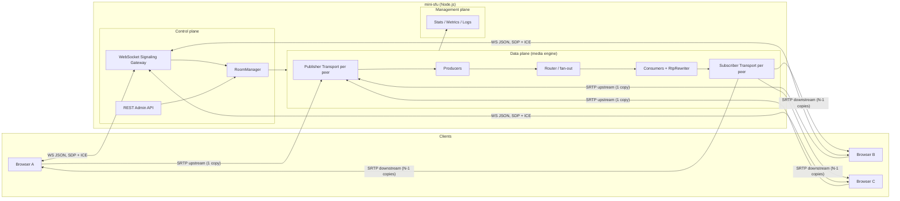
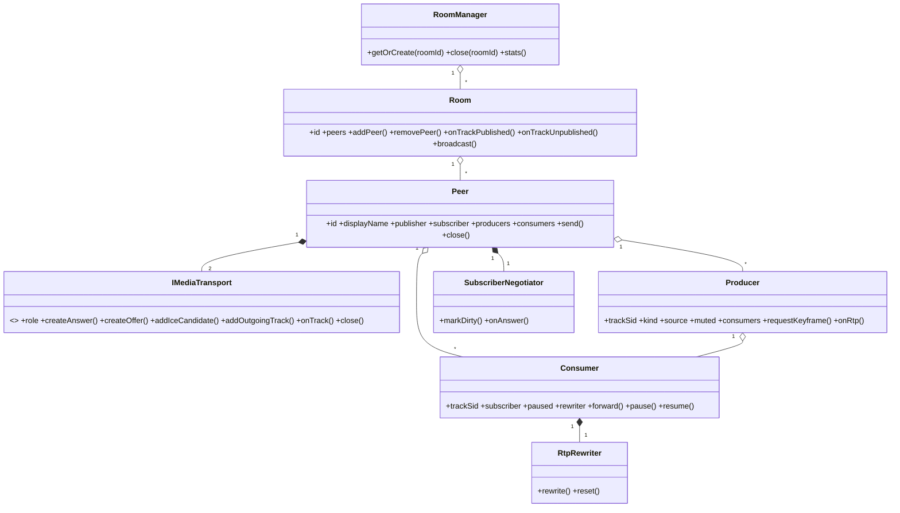
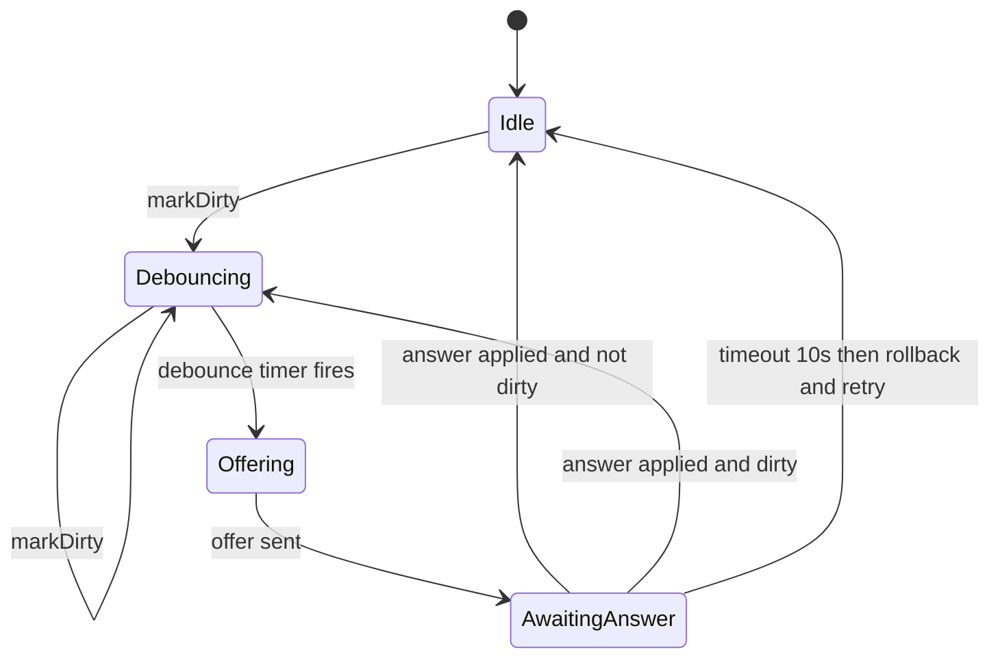
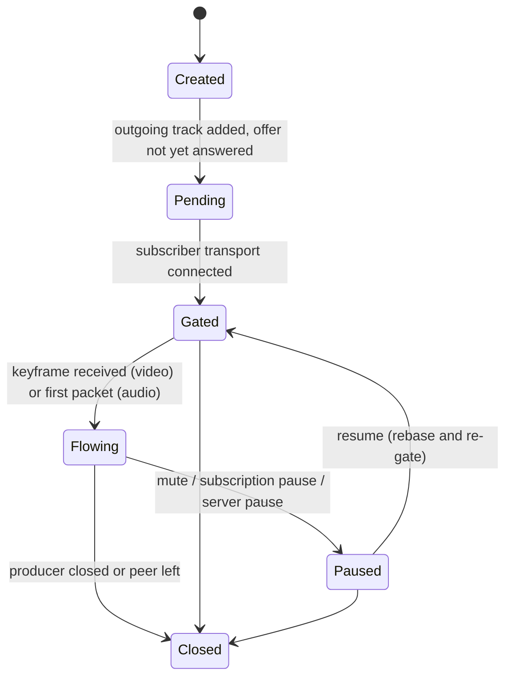

# Mini-SFU: Implementation Plan

| | |
|---|---|
| **Project** | `mini-sfu`: a from-scratch, abstraction-level Selective Forwarding Unit |
| **Runtime** | Node.js 20+ / TypeScript |
| **Topology** | N:N (every participant publishes and subscribes), server-mediated (no P2P mesh) |
| **Status** | Design approved for implementation |
| **Companion doc** | [`flow.md`](./flow.md): sequence and state diagrams |

---

## 1. Purpose and scope

### 1.1 Goals
1. Build an SFU core that replicates the **essential behaviours** of mediasoup / LiveKit at a simplified level:
   - rooms, peers, published tracks, subscriptions
   - RTP receive, **per-subscriber fan-out**, RTP rewriting
   - keyframe management (PLI), NACK handling, mute/pause
   - active-speaker detection, basic stats
2. Each participant uploads **one copy** of their media and the server forwards it to everyone else. Upstream cost is O(N), not O(N²) as in a mesh.
3. Keep the code small and readable: strong module boundaries, a few thousand lines, well-typed.
4. Provide a thin browser client SDK and a demo page.

### 1.2 Non-goals (MVP)
- Transcoding, mixing (that would be an MCU) or recording.
- Multi-node clustering or cascading SFUs (see §15).
- Production-grade bandwidth estimation (TWCC/GCC). We use a simple loss-based heuristic in a later phase.
- E2E encryption (insertable streams).
- SIP, RTMP or other gateways.

### 1.3 The "no existing SFU packages" constraint, interpreted
A WebRTC endpoint needs **ICE, DTLS-SRTP, SDP, RTCP**. These are transport primitives, not SFU logic, and re-implementing them is a multi-month cryptography/networking project that adds nothing to the SFU learning goal.

| Layer | Who builds it |
|---|---|
| ICE / DTLS / SRTP / SDP / RTCP primitives | **Off-the-shelf WebRTC library** (`werift`, pure TypeScript, hidden behind an adapter, see ADR-2). It is a WebRTC stack, **not** an SFU. |
| Rooms, peers, producers, consumers, routing, forwarding, RTP rewriting, keyframe gating, NACK/PLI policy, subscription policy, signaling protocol, speaker detection, stats | **Us. This is the SFU engine.** |

> If the constraint is meant to ban *all* WebRTC libraries, the adapter in §6.1 is the only part that changes, but you would need to implement ICE (RFC 8445), DTLS 1.2 (RFC 6347) and SRTP (RFC 3711) yourself. We do not recommend that.

---

## 2. Architecture decisions

| # | Decision | Rationale | Trade-off |
|---|---|---|---|
| ADR-1 | **SFU topology** (forward, don't mix) | Server CPU stays low and each receiver gets full quality. | Egress bandwidth is O(N²) per room, so we cap room size. |
| ADR-2 | **WebRTC stack = `werift`, wrapped by `IMediaTransport` adapter** | Pure TS: no native build, exposes raw RTP in and out, SDP/ICE/DTLS done. Adapter makes it swappable (e.g. `node-datachannel`). | Pure-JS SRTP is CPU-heavy, so expect ~tens of streams per core (see §14). |
| ADR-3 | **Two PeerConnections per peer**: *publisher* (client → server) and *subscriber* (server → client) | Removes SDP offer/answer glare. Each PC has exactly one offerer. Upload and download evolve independently. | Two ICE/DTLS handshakes per peer. |
| ADR-4 | **SDP (JSEP) over WebSocket signaling**, plus explicit `mid → id` maps in the messages | Works with unmodified browser `RTCPeerConnection`. The explicit maps avoid fragile reliance on `msid` parsing. | More verbose than a mediasoup-style, SDP-less protocol. |
| ADR-5 | **Fixed codec set: Opus (audio) + VP8 (video)** | Same payload types on every PC, so no PT translation and no transcoding. VP8 keyframe detection is simple. Supported in all browsers. | No H.264/AV1 in the MVP. |
| ADR-6 | **Auto-subscribe by default**, with per-track override | Natural for conference N:N. | Needs a subscription policy layer for large rooms. |
| ADR-7 | **Server-authoritative subscriber negotiation** | The server owns the set of forwarded tracks, so it generates offers. Negotiation is serialized with a small state machine. | Needs debouncing and a dirty flag (§9.2). |
| ADR-8 | **Per-consumer RTP rewriting** (SSRC, PT, seq, timestamp) | Needed for seamless pause/resume, keyframe-gated start and layer switches. | Small per-packet CPU cost. |
| ADR-9 | **Single Node process for MVP**; design `Room` as a shardable unit | Simple. Rooms are independent, so they can later be pinned to `worker_threads`. | MVP scales vertically only. |
| ADR-10 | **TypeScript, ESM, `ws`, `fastify`/`express` for REST** | Common, small, typed. `ws` and the HTTP framework are generic infrastructure and have no SFU functionality. | |

---

## 3. System overview



**Three planes**
- **Control plane**: signaling, auth, room/peer lifecycle, negotiation. Low rate, reliable (TCP/WS).
- **Data plane**: RTP/RTCP. High rate, latency-critical, UDP. Must never block on the control plane.
- **Management plane**: stats, logs, admin REST.

---

## 4. Domain model

| Entity | Meaning | Identity |
|---|---|---|
| **Room** | Isolated set of peers and tracks. Equivalent of a mediasoup *Router*. | `roomId` (client chosen or generated) |
| **Peer** | One connected participant (one WS session, two transports). | `peerId` (server generated, nanoid) |
| **Transport** | A WebRTC connection to one peer. Role = `publisher` or `subscriber`. | `transportId` |
| **Producer** (published track) | An incoming media track from a peer. | `trackSid` (`TR_xxxxxxxx`) |
| **Consumer** (subscription) | An outgoing copy of one Producer to one subscriber peer. | `(subscriberPeerId, trackSid)` |
| **RtpRewriter** | Per-consumer packet header translator. | owned by Consumer |

Cardinality: `Room 1—* Peer`, `Peer 1—* Producer`, `Producer 1—* Consumer`, `Peer 1—* Consumer`.
A room with N peers each publishing audio and video has **2N producers** and **2N(N-1) consumers**.



---

## 5. Repository layout

```
mini-sfu/
├─ package.json  tsconfig.json  .env.example  Dockerfile
├─ src/
│  ├─ main.ts                    # bootstrap: config → http → ws → engine
│  ├─ config.ts                  # env parsing and validation (zod)
│  ├─ api/
│  │  ├─ http.ts                 # REST routes (§7.2)
│  │  └─ auth.ts                 # JWT sign/verify
│  ├─ signaling/
│  │  ├─ protocol.ts             # message types and zod schemas (§7.1), shared with client
│  │  ├─ SignalingServer.ts      # WS accept, heartbeat, request/response correlation
│  │  └─ handlers/               # one file per method: join, publish, offer, answer, ice...
│  ├─ sfu/
│  │  ├─ RoomManager.ts
│  │  ├─ Room.ts
│  │  ├─ Peer.ts
│  │  ├─ Producer.ts
│  │  ├─ Consumer.ts
│  │  ├─ RtpRewriter.ts
│  │  ├─ SubscriberNegotiator.ts
│  │  ├─ SubscriptionPolicy.ts
│  │  ├─ KeyframeController.ts   # PLI throttling and periodic retry
│  │  ├─ PacketCache.ts          # ring buffer for NACK retransmit
│  │  ├─ SpeakerDetector.ts
│  │  ├─ LayerSelector.ts        # phase 6
│  │  └─ codecs/vp8.ts           # keyframe detection, payload descriptor parsing
│  ├─ transport/
│  │  ├─ IMediaTransport.ts      # adapter interface (§6.1)
│  │  └─ WeriftTransport.ts      # the only file that imports werift
│  └─ util/ (logger.ts, ids.ts, emitter.ts, timers.ts)
├─ client/
│  ├─ SfuClient.ts               # browser SDK (§7.3)
│  └─ demo/index.html            # video grid demo
└─ test/ (unit/, integration/, load/)
```

**Rule:** only `transport/WeriftTransport.ts` may import the WebRTC library. Everything else depends on `IMediaTransport`.

---

## 6. Core engine component specifications

### 6.1 Transport adapter (`IMediaTransport`)

```ts
export type TransportRole = 'publisher' | 'subscriber';
export type MediaKind = 'audio' | 'video';

export interface RtpPacket {
  header: {
    payloadType: number; sequenceNumber: number; timestamp: number;
    ssrc: number; marker: boolean;
    audioLevel?: { level: number; voice: boolean };  // parsed from ssrc-audio-level ext
    rid?: string;                                    // simulcast, phase 6
  };
  payload: Buffer;
}

export type RtcpFeedback =
  | { type: 'pli' } | { type: 'fir' }
  | { type: 'nack'; sequenceNumbers: number[] }
  | { type: 'receiverReport'; fractionLost: number; jitter: number; rttMs?: number };

export interface IncomingTrack {              // publisher side: media arriving
  readonly mid: string;
  readonly kind: MediaKind;
  readonly ssrc: number;
  readonly payloadType: number;
  onRtp(cb: (pkt: RtpPacket) => void): Unsubscribe;
  requestKeyframe(): void;                    // sends RTCP PLI to the publisher
  onClose(cb: () => void): Unsubscribe;
}

export interface OutgoingTrack {              // subscriber side: media leaving
  readonly mid: string | null;                // null until negotiated
  readonly kind: MediaKind;
  readonly ssrc: number;
  readonly payloadType: number;
  writeRtp(pkt: RtpPacket): void;             // transport SRTP-encrypts and sends
  onFeedback(cb: (fb: RtcpFeedback) => void): Unsubscribe;
  close(): void;
}

export interface IMediaTransport {
  readonly id: string;
  readonly role: TransportRole;
  readonly state: 'new' | 'connecting' | 'connected' | 'disconnected' | 'failed' | 'closed';

  // JSEP
  setRemoteDescription(d: { type: 'offer' | 'answer'; sdp: string }): Promise<void>;
  createAnswer(): Promise<{ type: 'answer'; sdp: string }>;
  createOffer(opts?: { iceRestart?: boolean }): Promise<{ type: 'offer'; sdp: string }>;
  // ICE
  addIceCandidate(c: IceCandidateInit): Promise<void>;
  onIceCandidate(cb: (c: IceCandidateInit) => void): Unsubscribe;
  onStateChange(cb: (s: IMediaTransport['state']) => void): Unsubscribe;

  // publisher role
  onTrack(cb: (t: IncomingTrack) => void): Unsubscribe;
  // subscriber role
  addOutgoingTrack(kind: MediaKind): OutgoingTrack;
  removeOutgoingTrack(t: OutgoingTrack): void;

  getStats(): Promise<TransportStats>;
  close(): void;
}
```

Implementation notes for `WeriftTransport`:
- Configure werift with a **fixed codec list** (Opus PT 111, VP8 PT 96, `nack`, `nack pli`, `ccm fir`) and negotiate the `ssrc-audio-level` header extension on the publisher side only.
- Configure UDP port range and announced/public IP from config (`RTC_MIN_PORT`, `RTC_MAX_PORT`, `PUBLIC_IP`).
- **Phase 0 spike must verify**: (a) raw RTP is accessible per received track, (b) the sender's `writeRtp` honours or overrides SSRC/PT/seq (the `RtpRewriter` makes us independent of the answer), (c) RTCP PLI/NACK are exposed in both directions.

### 6.2 Room
Responsibilities:
- Own the `peers` map. Enforce `maxPeersPerRoom`.
- `addPeer` / `removePeer`, including cleanup of that peer's producers and consumers.
- Orchestrate **publish → subscribe**: when a Producer becomes live, create a Consumer for every other peer (per `SubscriptionPolicy`) and mark each subscriber `dirty`.
- When a new peer joins, create Consumers for all existing live Producers (**late-joiner catch-up**).
- Fan out signaling notifications (`peer.joined`, `track.published`, …).
- Lifecycle: auto-close after `emptyRoomTtlMs` with zero peers.

### 6.3 Peer
- Holds `publisher: IMediaTransport`, `subscriber: IMediaTransport`, `producers: Map<trackSid, Producer>`, `consumers: Map<trackSid, Consumer>`, `negotiator`, and a `send(notification)` function bound to the WS.
- States: `JOINING → ACTIVE → DISCONNECTED(grace) → CLOSED` (see `flow.md` §10).

### 6.4 Producer
- Wraps an `IncomingTrack` plus metadata (`trackSid`, `kind`, `source`, `muted`).
- On every RTP packet:
  1. If `kind === 'audio'` → feed `SpeakerDetector`.
  2. If `muted` → drop.
  3. For video, remember the last keyframe info (VP8).
  4. Iterate `consumers` and call `consumer.forward(pkt)`. **Never mutate the shared packet**; the rewriter clones the header.
- `requestKeyframe(reason)`: delegates to `KeyframeController` (throttled).

### 6.5 Consumer
- Binds `(Producer, subscriber Peer, OutgoingTrack)`.
- State: `{ paused, pausedByServer, keyframeGate, rewriter, packetCache }`.
- `forward(pkt)`:
  ```
  if paused → drop
  if kind==video and keyframeGate.closed:
       if isVp8Keyframestart(pkt) → open gate, rewriter.rebase(pkt)
       else → drop and ensure a PLI is pending; return
  out = rewriter.rewrite(pkt)         // ssrc, pt, seq, ts
  if kind==video → packetCache.put(out)
  outgoing.writeRtp(out)
  ```
- Feedback handling (from the subscriber):
  - `pli`/`fir` → `producer.requestKeyframe()`
  - `nack` → resend from `packetCache` (video only). Packets not cached are ignored.
  - `receiverReport` → feed the `LayerSelector` / stats.

### 6.6 RtpRewriter
Per consumer. Makes the outbound stream look like a continuous, single-source RTP stream even if the inbound stream pauses, is gated, or switches layer.

State: `seqOffset`, `tsOffset`, `lastOutSeq`, `lastOutTs`, `ssrc`, `payloadType`.

```ts
rebase(first: RtpPacket) {                 // called at start, resume, layer switch (at a keyframe)
  const nextSeq = (lastOutSeq + 1) & 0xffff;
  const nextTs  = (lastOutTs + frameTicks) >>> 0;   // frameTicks: video 3000, audio 960
  seqOffset = (nextSeq - first.header.sequenceNumber) & 0xffff;
  tsOffset  = (nextTs  - first.header.timestamp) >>> 0;
}
rewrite(pkt) {
  h = { ...pkt.header,
        ssrc: this.ssrc, payloadType: this.payloadType,
        sequenceNumber: (pkt.header.sequenceNumber + seqOffset) & 0xffff,
        timestamp:      (pkt.header.timestamp + tsOffset) >>> 0,
        extension: false };                 // strip unnegotiated header extensions
  lastOutSeq = h.sequenceNumber; lastOutTs = h.timestamp;
  return { header: h, payload: pkt.payload };   // payload buffer shared, zero-copy
}
```

### 6.7 KeyframeController
- Coalesces PLI requests per Producer: at most one every `PLI_THROTTLE_MS` (default 500 ms).
- While any consumer's `keyframeGate` is closed, re-requests every 1 s (max 5 retries) until a keyframe arrives.
- Triggers: new consumer, resume from pause, subscriber PLI/FIR, layer switch.

### 6.8 SubscriberNegotiator
Serializes server-initiated renegotiation of one subscriber PC (details in §9.2).
Inputs: `markDirty()`. Outputs: `subscriber.offer` notification. Consumes: `subscriber.answer`.

### 6.9 SubscriptionPolicy
```ts
interface SubscriptionPolicy {
  shouldAutoSubscribe(subscriber: Peer, producer: Producer): boolean;
}
```
MVP default: subscribe to everything except one's own tracks. Optional policy: `lastN` (only the N most recent active speakers' video), which is the main scale lever for large rooms.

### 6.10 SpeakerDetector
- Reads `ssrc-audio-level` (RFC 6464: 0 = loudest, 127 = silence, in −dBov) from publisher audio packets.
- Sliding window of 500 ms; a peer is "speaking" if average level ≤ `SPEAKER_THRESHOLD` (default 50) with a voice-activity flag.
- Emits `speakers.changed` at most every 300 ms, top K=3, only when the set or order changes.

### 6.11 PacketCache
Per-consumer ring buffer (default 256 packets, video only) keyed by outbound sequence number. Used to serve NACKs without involving the publisher. Memory per consumer ≈ 256 × ~1.2 KB ≈ 300 KB at worst, which is acceptable at the room sizes we cap.

---

## 7. API contracts

### 7.1 Signaling API (WebSocket, JSON)

**Endpoint:** `wss://<host>/ws?room=<roomId>&token=<jwt>` (token optional in dev mode)
**Encoding:** UTF-8 JSON text frames. One envelope per frame.

#### Envelope

```ts
type Request      = { type: 'request';      id: number; method: string; params: object };
type Response     = { type: 'response';     id: number; ok: true;  data: object }
                  | { type: 'response';     id: number; ok: false; error: { code: ErrorCode; message: string } };
type Notification = { type: 'notification'; event: string; data: object };
```
- `id` is a client-chosen monotonic integer. The server echoes it in the response. The server never reuses ids for its own requests, since it sends **notifications only** and the client answers via a client request.
- Timeouts: client request timeout 10 s. Server heartbeat: client sends `ping` every 15 s, server closes after 45 s without traffic (close code `4008`).

#### Common types

```ts
type TrackSource = 'microphone' | 'camera' | 'screen';
interface TrackInfo   { trackSid: string; peerId: string; kind: 'audio'|'video'; source: TrackSource; muted: boolean; }
interface PeerInfo    { peerId: string; displayName: string; tracks: TrackInfo[]; }
interface IceCandidateInit { candidate: string; sdpMid: string | null; sdpMLineIndex: number | null; }
interface SessionDescription { type: 'offer' | 'answer'; sdp: string; }
```

#### Client → Server requests

**`join`** — must be the first request after the socket opens.
```jsonc
// params
{ "displayName": "Alice", "autoSubscribe": true, "reconnectToken": null }
// response.data
{
  "peerId": "p_8f3k2a",
  "roomId": "demo",
  "iceServers": [{ "urls": ["stun:stun.l.google.com:19302"] }],
  "serverConfig": { "codecs": { "audio": "opus", "video": "vp8" }, "pingIntervalMs": 15000, "maxVideoBitrateKbps": 1500 },
  "peers": [ /* PeerInfo[] already in the room, with their live tracks */ ],
  "reconnectToken": "rt_..."
}
```
After a successful join with `autoSubscribe`, the server will (asynchronously) send a `subscriber.offer` if there are existing tracks.

**`track.publish`** — declares an upcoming track **before** the publisher offer.
```jsonc
// params
{ "cid": "c0b1…(client MediaStreamTrack.id)", "kind": "video", "source": "camera",
  "simulcast": false /* phase 6 */ }
// response.data
{ "trackSid": "TR_a1b2c3d4" }
```

**`publisher.offer`** — client offer on the publisher PC. `mids` binds SDP media sections to the declared `cid`s.
```jsonc
// params
{ "sdp": { "type": "offer", "sdp": "v=0…" }, "mids": [ { "mid": "0", "cid": "c0b1…" }, { "mid": "1", "cid": "9e7d…" } ] }
// response.data
{ "sdp": { "type": "answer", "sdp": "v=0…" } }
```
The server creates a Producer once the transport reports `onTrack` for a bound `mid`, then emits `track.published` to peers.

**`subscriber.answer`** — answer to a server `subscriber.offer`.
```jsonc
// params  { "sdp": { "type": "answer", "sdp": "v=0…" }, "offerId": 17 }
// response.data  {}
```

**`ice.candidate`** — trickle ICE (also server → client as a notification, same payload).
```jsonc
// params  { "target": "publisher" | "subscriber", "candidate": IceCandidateInit | null /* null = end-of-candidates */ }
// response.data  {}
```

**`track.mute`** — `{ "trackSid": "TR_…", "muted": true }` → `{}`. The server stops forwarding and notifies peers (`track.muted`). Video: the gate re-closes on unmute and a PLI is sent.

**`track.unpublish`** — `{ "trackSid": "TR_…" }` → `{}`. The server tears down the Producer and all its Consumers. The client must renegotiate the publisher PC afterwards.

**`subscription.update`** — per-track control for a subscriber.
```jsonc
// params
{ "trackSid": "TR_…", "subscribed": true, "paused": false,
  "preferredLayer": "high" /* phase 6: low|medium|high */ }
// response.data  {}
```

**`ice.restart`** *(phase 7)* — `{ "target": "publisher"|"subscriber" }` → `{ "sdp": SessionDescription }` (a server offer for the subscriber, a server answer for the publisher after the client's new offer).

**`ping`** — `{}` → `{ "ts": 1710000000000 }`.

**`leave`** — `{}` → `{}`, then the server closes the socket with code `1000`.

#### Server → Client notifications

| Event | `data` | When |
|---|---|---|
| `peer.joined` | `{ peer: PeerInfo }` | Another peer joined |
| `peer.left` | `{ peerId, reason: 'left'\|'timeout'\|'kicked' }` | Peer left or timed out |
| `track.published` | `{ track: TrackInfo }` | A producer became live |
| `track.unpublished` | `{ trackSid, peerId }` | Producer removed |
| `track.muted` | `{ trackSid, peerId, muted }` | Mute toggled |
| `subscriber.offer` | `{ offerId, sdp: SessionDescription, mids: [{ mid, trackSid, peerId }] }` | Subscription set changed |
| `ice.candidate` | `{ target, candidate }` | Server-side trickle |
| `speakers.changed` | `{ speakers: [{ peerId, level }] }` | Active speaker set changed |
| `subscription.changed` | `{ trackSid, paused: boolean, reason: 'bandwidth'\|'policy', layer?: string }` | Server-side pause/layer change (phase 6) |
| `connection.quality` | `{ peerId, quality: 'excellent'\|'good'\|'poor' }` | Phase 6 |
| `room.closed` | `{ reason }` | Admin closed the room |

#### Error codes

| Code | Meaning | Close socket? |
|---|---|---|
| `INVALID_MESSAGE` | Schema validation failed | no |
| `NOT_JOINED` / `ALREADY_JOINED` | Method order violation | no |
| `UNAUTHORIZED` | Bad/expired token | yes (`4001`) |
| `ROOM_FULL` | `maxPeersPerRoom` reached | yes |
| `ROOM_CLOSED` | Room was closed | yes (`4002`) |
| `TRACK_NOT_FOUND` | Unknown `trackSid` / `cid` | no |
| `NEGOTIATION_FAILED` | SDP error or transport failure | no (client may retry) |
| `RATE_LIMITED` | Too many requests | no |
| `INTERNAL` | Unexpected | no |

Custom WS close codes: `4001` unauthorized, `4002` room closed, `4003` replaced by newer session of the same peer, `4008` heartbeat timeout.

---

### 7.2 REST admin API

Base path `/api`. Auth: `Authorization: Bearer <ADMIN_API_KEY>` (except `/healthz`).

| Method & path | Request | Response |
|---|---|---|
| `GET /healthz` | – | `200 { "status": "ok", "uptimeSec": 123 }` |
| `POST /api/rooms` | `{ "roomId"?: string, "maxPeers"?: number }` | `201 { "roomId": "demo", "maxPeers": 16, "createdAt": "ISO" }` · `409` if it exists |
| `GET /api/rooms` | – | `200 { "rooms": [ { "roomId", "peerCount", "trackCount", "createdAt" } ] }` |
| `GET /api/rooms/:roomId` | – | `200 { "roomId", "peers": [PeerInfo…], "stats": RoomStats }` · `404` |
| `DELETE /api/rooms/:roomId` | – | `204` (peers get `room.closed`) |
| `POST /api/rooms/:roomId/token` | `{ "displayName"?: string, "ttlSec"?: number }` | `200 { "token": "<jwt>", "expiresAt": "ISO" }` |
| `DELETE /api/rooms/:roomId/peers/:peerId` | – | `204` (kick) |
| `GET /api/stats` | – | `200 EngineStats` |
| `GET /metrics` | – | Prometheus text format (optional) |

Errors use `{ "error": { "code": "…", "message": "…" } }` with the usual 4xx/5xx codes.

```ts
interface RoomStats    { peers: number; producers: number; consumers: number; ingressKbps: number; egressKbps: number; }
interface ProducerStats{ trackSid; kind; bitrateKbps; packets; packetsLost; jitterMs; keyframes; plisSent; }
interface ConsumerStats{ trackSid; subscriberPeerId; bitrateKbps; packetsSent; nacksReceived; retransmits; plisReceived; paused; layer?; }
interface EngineStats  { rooms: number; peers: number; producers: number; consumers: number; cpuLoad: number; rssMb: number; eventLoopLagMs: number; }
```

### 7.3 Browser client SDK contract (`SfuClient`)

```ts
class SfuClient extends EventEmitter {
  constructor(opts: { url: string; token?: string; roomId: string; displayName: string });

  connect(): Promise<JoinResult>;                         // WS + join + create PCs
  disconnect(): Promise<void>;

  publish(track: MediaStreamTrack, source: TrackSource): Promise<LocalTrack>;  // track.publish + offer
  unpublish(local: LocalTrack): Promise<void>;
  setMuted(local: LocalTrack, muted: boolean): Promise<void>;

  setSubscription(trackSid: string, p: { subscribed?: boolean; paused?: boolean; preferredLayer?: string }): Promise<void>;

  readonly peers: ReadonlyMap<string, RemotePeer>;

  // events
  on(e: 'peerJoined',        cb: (p: RemotePeer) => void): this;
  on(e: 'peerLeft',          cb: (peerId: string) => void): this;
  on(e: 'trackSubscribed',   cb: (t: MediaStreamTrack, info: TrackInfo, peer: RemotePeer) => void): this;
  on(e: 'trackUnsubscribed', cb: (info: TrackInfo) => void): this;
  on(e: 'trackMuted',        cb: (info: TrackInfo, muted: boolean) => void): this;
  on(e: 'activeSpeakers',    cb: (peerIds: string[]) => void): this;
  on(e: 'connectionState',   cb: (s: 'connecting'|'connected'|'reconnecting'|'disconnected') => void): this;
  on(e: 'error',             cb: (err: Error) => void): this;
}
```
Client internals: on `subscriber.offer` → `setRemoteDescription` → `createAnswer` → `setLocalDescription` → `subscriber.answer`. Incoming tracks are matched to `trackSid` by `transceiver.mid` using the `mids` map from the offer. The client prefers codecs via `setCodecPreferences` (Opus, VP8).

### 7.4 Configuration contract (env)

| Variable | Default | Description |
|---|---|---|
| `PORT` | `8080` | HTTP + WS port |
| `PUBLIC_IP` | auto | IP announced in ICE candidates (**required** behind NAT/cloud) |
| `RTC_MIN_PORT` / `RTC_MAX_PORT` | `40000` / `40100` | UDP port range |
| `ICE_SERVERS` | Google STUN | JSON list sent to clients (add TURN here) |
| `MAX_PEERS_PER_ROOM` | `16` | Hard cap |
| `EMPTY_ROOM_TTL_MS` | `30000` | Auto-close empty rooms |
| `AUTH_MODE` | `none` | `none` \| `jwt` |
| `JWT_SECRET`, `ADMIN_API_KEY` | – | |
| `PLI_THROTTLE_MS` | `500` | Min gap between PLIs per producer |
| `NEGOTIATION_DEBOUNCE_MS` | `50` | Batch subscription changes into one offer |
| `RECONNECT_GRACE_MS` | `10000` | Peer retained after WS drop |
| `SPEAKER_THRESHOLD` | `50` | −dBov threshold |
| `PACKET_CACHE_SIZE` | `256` | Per video consumer |
| `LOG_LEVEL` | `info` | |

---

## 8. Media pipeline details

### 8.1 Why decrypt and re-encrypt (and why an SFU is not a dumb relay)
SRTP keys are per-DTLS-session. A packet from Alice's publisher PC cannot be sent as-is to Bob. The transport decrypts it (Alice's key), the engine rewrites headers, and Bob's transport encrypts it (Bob's key). This is the main CPU cost of the SFU.

### 8.2 Forwarding rules
1. **Audio:** forward immediately. Rewrite SSRC, PT, seq, timestamp.
2. **Video:** forward only after the gate sees a **keyframe start**. A subscriber that starts mid-GOP cannot decode, so we drop until a keyframe and request one by PLI.
3. **Mute / pause:** drop on the server. On resume, `rebase` the rewriter (continuous seq/ts) and re-gate video.
4. **Header extensions:** stripped on the subscriber side (not negotiated), except any we explicitly add later (e.g. `abs-send-time`).

### 8.3 VP8 keyframe detection (`codecs/vp8.ts`)
```ts
// RFC 7741 payload descriptor
function isVp8KeyframeStart(payload: Buffer): boolean {
  let i = 0;
  const b0 = payload[i++];
  const X = (b0 & 0x80) !== 0, S = (b0 & 0x10) !== 0, PID = b0 & 0x07;
  if (!(S && PID === 0)) return false;           // must be the first packet of partition 0
  if (X) {
    const ext = payload[i++];
    if (ext & 0x80) { const pidByte = payload[i++]; if (pidByte & 0x80) i++; } // I: PictureID 7 or 15 bits
    if (ext & 0x40) i++;                          // L: TL0PICIDX
    if (ext & 0x30) i++;                          // T/K: TID/KEYIDX
  }
  return (payload[i] & 0x01) === 0;               // VP8 payload header P bit: 0 = keyframe
}
```

### 8.4 RTCP handling matrix

| Feedback | Direction | Our action |
|---|---|---|
| **PLI / FIR** from subscriber | subscriber → server | `producer.requestKeyframe()` (throttled), then forward to publisher as PLI |
| **NACK** from subscriber | subscriber → server | Resend from the consumer's `PacketCache`. No round trip to the publisher. |
| **NACK** for publisher stream gaps | server → publisher | Delegated to the transport's receiver (verify in Phase 0). If not supported, implement a minimal NACK generator on gap detection. |
| **Receiver Report** from subscriber | subscriber → server | Update stats and feed the loss heuristic (phase 6) |
| **Sender Report** to subscriber | server → subscriber | Generated by the transport's sender (keeps A/V lip-sync) |

### 8.5 Simulcast (phase 6, stretch)
- Publisher sends 3 encodings (`rid` = `q`/`h`/`f`, e.g. 180p/360p/720p) in one m-section.
- `IncomingTrack` yields RTP tagged with `rid`. The Producer holds 3 sub-streams.
- `LayerSelector` per consumer picks the target layer from (a) `preferredLayer`, (b) subscriber loss heuristic, (c) tile size hints.
- Switching: request a keyframe on the target layer → on its first keyframe, `rewriter.rebase(...)` and swap the source. Never switch mid-GOP.
- If the WebRTC library has insufficient simulcast support, ship phase 6 as "SVC-less multi-track" (publish three separate video tracks) or defer it.

### 8.6 Loss-based congestion heuristic (phase 6)
Every 2 s per consumer: if `fractionLost > 10%` for 2 consecutive reports → step down the layer (or pause video, keeping audio). If `< 2%` for 10 s → step up. Hysteresis prevents flapping. This is intentionally not GCC/TWCC.

---

## 9. Concurrency model and state machines

### 9.1 Event-loop discipline
- The RTP path is **synchronous and allocation-light**: no `await`, no logging at `info` per packet, no JSON.
- Control-plane operations per Peer are processed through a **per-peer async queue** (promise chain) so `join/publish/offer/answer` never interleave.
- Never `await` inside `Producer.onRtp`. Metrics use counters and are aggregated on a timer.
- Monitor event-loop lag. Alert above 50 ms.

### 9.2 Subscriber negotiation state machine


Rules: only one outstanding offer. Changes that arrive while awaiting an answer set `dirty = true` and are folded into the next offer. The offer carries an incrementing `offerId` and the answer must echo it. Stale answers are discarded.

### 9.3 Consumer state



---

## 10. Phased roadmap

Estimates assume one senior engineer. Each phase ends with a demoable, testable increment.

### Phase 0: De-risking spike (2 days)
- [ ] Node server with werift: accept one browser publisher offer, receive RTP, loop it back to a second browser subscriber via a server offer.
- [ ] Verify the three open questions in §6.1 (raw RTP access, `writeRtp` semantics, RTCP exposure).
- [ ] Measure CPU for 1 → 5 forwarded video streams.
- **Exit gate:** a decision record confirming werift (or the switch to an alternative adapter).

### Phase 1: Foundations and signaling (3 days)
- [ ] Project scaffolding, config (zod), logger, lint, CI.
- [ ] `protocol.ts` schemas and `SignalingServer` (envelope, correlation, heartbeat, error mapping).
- [ ] `RoomManager`, `Room`, `Peer` with `join` / `leave` / `peer.joined` / `peer.left`.
- [ ] REST `healthz`, rooms CRUD.
- **Acceptance:** two WS clients join one room and see each other's `peer.joined`; request validation errors return proper codes; unit tests ≥ 80% for the protocol layer.

### Phase 2: Publish path (4 days)
- [ ] `IMediaTransport` + `WeriftTransport` (publisher role).
- [ ] `track.publish`, `publisher.offer`, `ice.candidate` handlers.
- [ ] `Producer` creation on `onTrack`; mid ↔ cid binding; `track.published` / `track.unpublished`.
- **Acceptance:** a browser publishes mic and camera. Server stats show inbound bitrate. Unpublish removes the Producer.

### Phase 3: Subscribe path and N:N MVP (5 days)
- [ ] Subscriber transport, `Consumer`, `RtpRewriter` (basic), `SubscriberNegotiator`.
- [ ] Late-joiner catch-up. `subscriber.offer` / `subscriber.answer`.
- [ ] Browser `SfuClient` + demo grid.
- **Acceptance:** 4 browsers in a room, everyone sees and hears everyone. A late joiner receives all existing streams. Leaving peers' tiles disappear.

### Phase 4: Media quality and control (5 days)
- [ ] `KeyframeController`, keyframe gate, VP8 detection, PLI forwarding.
- [ ] `PacketCache` and NACK retransmit.
- [ ] `track.mute`, `subscription.update` (pause/resume) with correct rebase.
- [ ] Sequence/timestamp continuity tests (including wrap-around).
- **Acceptance:** with 5% simulated packet loss video remains watchable. Time-to-first-frame for a late joiner is < 2 s. Mute/unmute does not freeze or glitch the remote video.

### Phase 5: Speaker detection, stats, auth, hardening of the API (3 days)
- [ ] `SpeakerDetector`, `speakers.changed`.
- [ ] Producer/consumer/room stats, `/api/stats`, `/metrics`.
- [ ] JWT auth and admin API key. Rate limiting. `MAX_PEERS_PER_ROOM`.
- **Acceptance:** active speaker highlighting works in the demo. Unauthorized joins are rejected with `4001`.

### Phase 6: Simulcast and adaptive layers (6 days, stretch)
- [ ] Multi-encoding publish, `rid` demux, per-consumer `LayerSelector`, keyframe-aligned switching.
- [ ] Loss heuristic. `subscription.changed` and `connection.quality`.
- **Acceptance:** throttling one subscriber's network lowers only that subscriber's layer. The others are unaffected.

### Phase 7: Resilience and scale-up (5 days)
- [ ] Reconnect with grace period (`reconnectToken`), ICE restart, mid recycling.
- [ ] Room sharding across `worker_threads` (room → worker affinity).
- [ ] Load test harness, Dockerfile, deployment notes (UDP ports, host networking, TURN).
- **Acceptance:** killing a client WS and reconnecting within 10 s restores media without re-joining. A load test documents capacity per core.

**Total: ~33 working days (~7 weeks)**, with Phase 6 optional. The **MVP (Phases 0 to 4) takes ~19 days**.

---

## 11. Testing strategy

| Level | What | How |
|---|---|---|
| **Unit** | `RtpRewriter` (wrap-around, rebase, pause/resume), `vp8.ts` keyframe detection against recorded vectors, `PacketCache`, `SubscriberNegotiator` state machine, `SpeakerDetector`, protocol schemas | Vitest, property tests for seq/ts arithmetic |
| **Component** | Room/Peer/Producer/Consumer with a **`FakeTransport`** implementing `IMediaTransport` (pushes synthetic RTP, records outbound) | Vitest. Verifies fan-out counts, gating, mute, teardown with no network |
| **Integration** | Real WS signaling + real WebRTC | Playwright with Chromium flags `--use-fake-device-for-media-stream --use-fake-ui-for-media-stream` (N headless browsers in one room); assert received frames via `getStats()` |
| **Impairment** | Packet loss, latency, jitter | `tc netem` or Docker network shaping. Assert NACK/PLI behaviour and recovery |
| **Load** | N rooms × M peers using headless bots (or a Node bot publishing pre-recorded RTP) | Record CPU, event-loop lag, egress Mbps, and the max stable streams per core |
| **Soak** | 1 h with churn (join/leave/mute) | Check memory growth and leaked transports/timers |

CI: unit + component on every PR. Integration (Playwright) nightly or on the main branch.

---

## 12. Observability

- **Structured logs** (pino) with `roomId`, `peerId`, `trackSid` correlation fields. No per-packet logs above `trace`.
- **Metrics:** gauges (rooms, peers, producers, consumers), counters (PLIs, NACKs, retransmits, dropped-while-gated packets, negotiation failures), histograms (join latency, time-to-first-keyframe, negotiation duration, event-loop lag).
- **Debug hooks:** `GET /api/rooms/:id` includes per-track stats. An optional per-consumer "trace next 100 packets" flag for debugging rewriter issues.
- **Client:** expose `RTCPeerConnection.getStats()` in the demo overlay (bitrate, fps, loss, resolution).

---

## 13. Security

- **Auth:** short-lived JWT (room-scoped) for `/ws`. Admin API key for REST. TLS terminated at the reverse proxy (WS must be `wss://`).
- **Validation:** every inbound message through zod. Max message size 256 KB (SDP). Per-connection rate limit (e.g. 50 req/s).
- **Isolation:** a peer can only affect its own tracks (`trackSid` ownership checks on `unpublish` / `mute`). Subscriptions only to tracks in the same room.
- **Media:** DTLS-SRTP is mandatory (WebRTC default). Verify the DTLS fingerprint from the SDP. Reject plain RTP.
- **Resource limits:** max tracks per peer (e.g. 4), max peers per room, max rooms per node, SDP size limits.
- **DoS:** drop the WS on repeated invalid messages. Cap pending negotiations per peer.
- **Network:** restrict the UDP port range. Document TURN deployment (coturn) for restrictive NATs, as separate infrastructure.

---

## 14. Risks and mitigations

| Risk | Impact | Mitigation |
|---|---|---|
| Pure-JS SRTP throughput (CPU-bound on one thread) | Low capacity per process | Room sharding over `worker_threads` (P7). Cap room size. Adapter allows swapping to a native stack (`node-datachannel`). Measure in P0. |
| WebRTC library gaps (simulcast, NACK generation, RTCP exposure) | Features blocked | P0 spike. Adapter boundary. Fallbacks in §8.4 and §8.5. |
| Renegotiation races/glare | Broken subscriptions | Two-PC design plus `SubscriberNegotiator` state machine plus `offerId` check. |
| Keyframe storms (many subscribers → many PLIs) | Publisher bitrate spikes | PLI coalescing and throttle in `KeyframeController`. |
| Seq/timestamp bugs causing frozen video | Hard-to-debug glitches | Isolated, property-tested `RtpRewriter`. Packet trace flag. |
| NAT/firewall in deployment | Connections fail | `PUBLIC_IP`, fixed UDP range, TURN documented. |
| O(N²) egress at larger room sizes | Bandwidth saturation | `MAX_PEERS_PER_ROOM`, `lastN` subscription policy, simulcast. |
| Event-loop stalls (GC, sync work) | Audio glitches | No allocations in hot path, reuse buffers, lag alarms. |

Capacity rule of thumb for planning: a room of N peers, each publishing 1 Mbps video, produces `N × (N−1) × 1 Mbps` egress (N = 10 → 90 Mbps).

---

## 15. Future extensions (out of scope, design-compatible)

- **Multi-node:** room-to-node affinity via a registry (Redis), signaling router, then SFU cascading (relay Producers between nodes via a pipe transport).
- **Recording:** add a server-side "recorder consumer" that writes RTP to disk.
- **Bandwidth estimation:** TWCC feedback and a GCC-like controller.
- **More codecs:** H.264/AV1 (new keyframe parsers, PT mapping in the rewriter).
- **Data channels / chat**, **E2EE** (insertable streams), **dominant-speaker** algorithms beyond the threshold approach.

---

## 16. Definition of done (MVP)

- [ ] ≥ 4 browsers in one room, audio + video, everyone-to-everyone, with a late joiner.
- [ ] Mute, unmute, unpublish, leave, and abrupt disconnect all clean up server state (no leaked consumers or timers).
- [ ] PLI/keyframe gating verified: no corrupted video at join. NACK recovers from 5% loss.
- [ ] Signaling API matches §7.1 and is covered by schema tests.
- [ ] Unit + component test suites green in CI. Playwright N-party smoke test green.
- [ ] README with run instructions, config table, architecture summary, and known limits.
